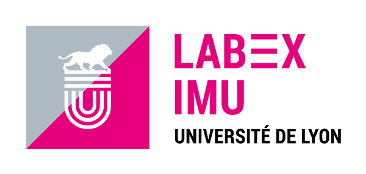
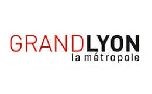
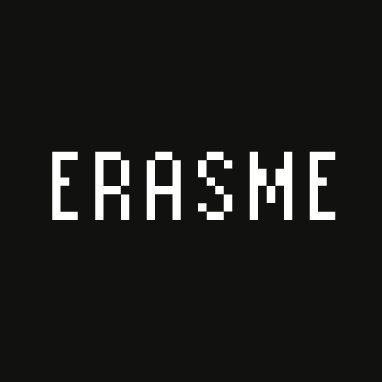
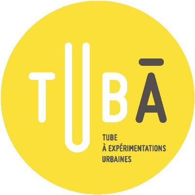

# Contributors and contacts

* **Gilles GESQUIERE** : Professor, Head of Vcity project (since 2013)  
gilles.gesquiere (at) universite-lyon.fr
* **Didier CHANFRAY** : Serious game/video games animator of LabEx IMU (until Feb. 2022)
* **Antoine WEBANCK** : Research Engineer (Mar. - Dec 2021)  
antoine.webanck (at) liris.cnrs.fr
* **Laurène SMYKOWSKI** : Project Engineer (Jun. - Dec 2021) 
* **Corentin GAUTIER** : Engineer Internship (May - Sep. 2020)
* **Homère BOURGEOIS** :
  * Developement Engineer (Nov. 2020 - Jul. 2021)
  * Engineer Internship (June - Nov. 2020)

# Partners

## Lyon University

|[ASLAN](https://aslan.universite-lyon.fr/)|[Labex IMU](https://imu.universite-lyon.fr/)|[LIRIS](https://liris.cnrs.fr/)|
|-|-|-|
||||

***

## Lyon Metropolis

|[GrandLyon](https://met.grandlyon.com/data-grandlyon/)|[Erasme](https://www.erasme.org/-UrbanLab)|
|-|-|
|||

***

## Collaborating Institutions

|[Tuba](http://www.tuba-lyon.com/)|
|-|
||

# Related Pages

[DatAgora Erasme](https://www.erasme.org/DatAgora)
