# Dispositifs disponibles

Plusieurs dispositifs ont déjà pu être réalisés par nous ou nos partenaires dans le cadre de différents évènements ou projets de recherche. 

## Dispositif Totem DatAgora (au laboratoire des Usages Erasme, Métropole de Lyon) 
Ce dispositif permet de présenter une maquette sur laquelle sont projetée des données géospatiales. Il s'agit d'une installation qui permet à un public de circuler autour de la maquette et d'interagir  afin de modifier les paramètres d’affichage des couches de données projetées, via des interfaces innovantes dédiées. Il comporte plusieurs outils d'affichage, qui permettent à la fois une projection sur la maquette mais également autour d'elle via un écran et des projecteurs de lumière.
[En savoir plus](technical_details)

## Dispositif mur d'écran
### Plateforme Amigo
La plateforme Amigo est une plateforme expérimentale autour de l’analyse de données massives de trajectoires issues de différentes sources de données : simulation numérique, GPS, flux vidéos, capteurs de mouvement. Elle est développée par l'Ecole Centrale de Lyon. La particularité de la plateforme est de permettre une analyse de bout en bout, du stockage jusqu’à la visualisation des données dans le but de la détection/reconnaissance d’anomalies, modélisation ou communication scientifique. Cette installation a été récemment renforcée grâce à la mise en place d'un mur d'écran. Cette installation a été conçue par [Romain Vuillemot](https://www.ec-lyon.fr/contacts/romain-vuillemot) et son équipe et est actuellement hébergée à l'Ecole Centrale de Lyon.
 

  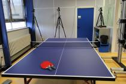
  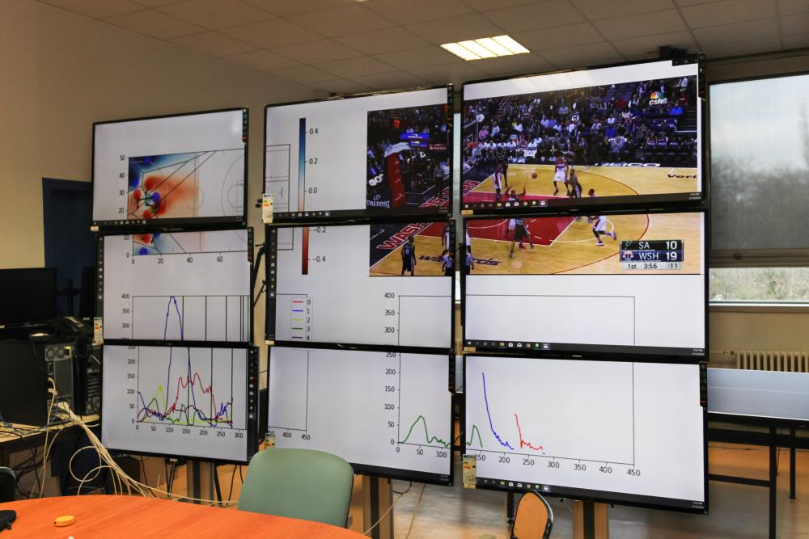 
  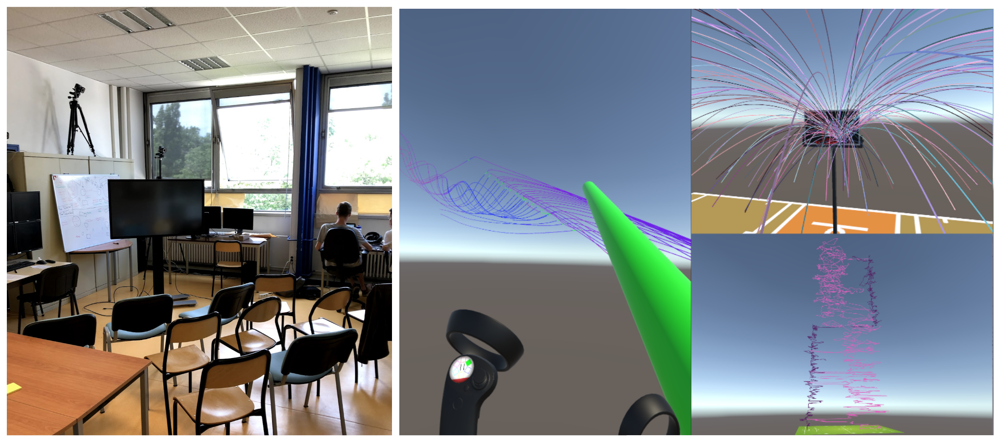

[En savoir plus](https://amigocap.github.io/)

### Salle Du LabEx Aslan
Un dispositif de mur d'écrans est également en cours de développement au sein du LabEx ASLAN.

 

  
   

## Dispositif d'expérimentation mobile dans le cadre de DatAgora

### Prototype 1 : Dispositif utilisé en 2019 pour la semaine de l'anthropocène de l'EUL
 

  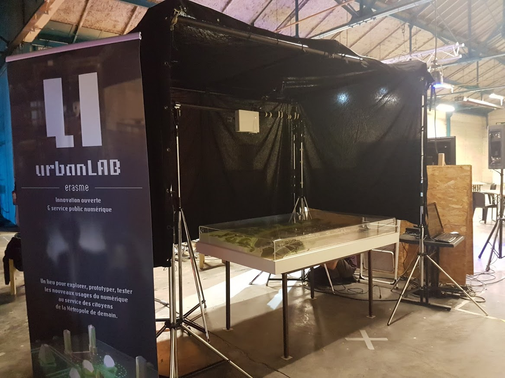
  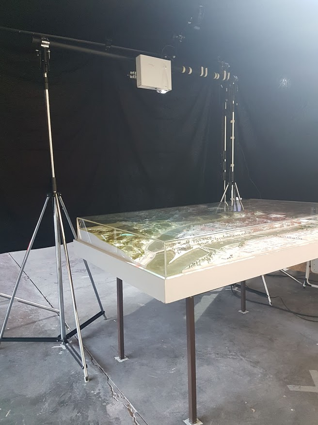 
  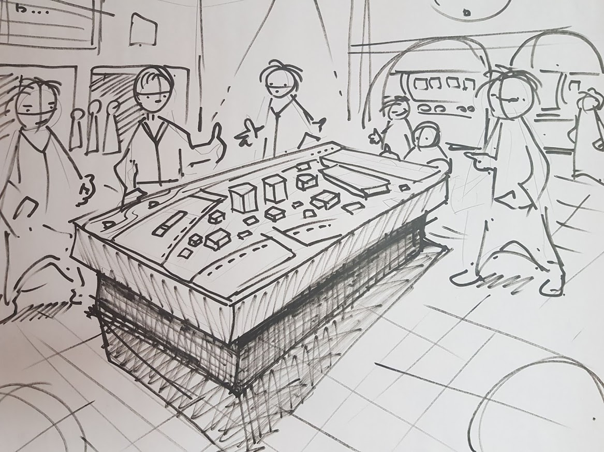
  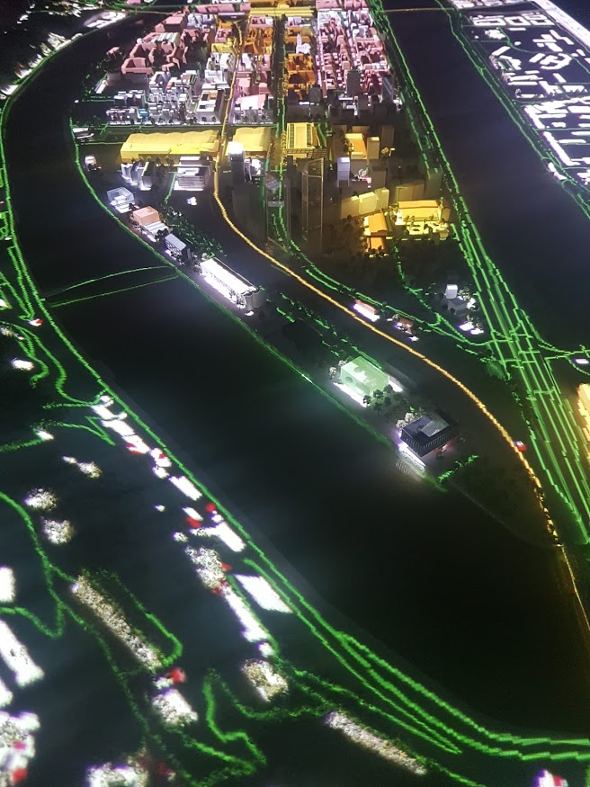

### Prototype 2 : Dispositif 2020 pour la semaine de l'anthropocène de l'EUL

  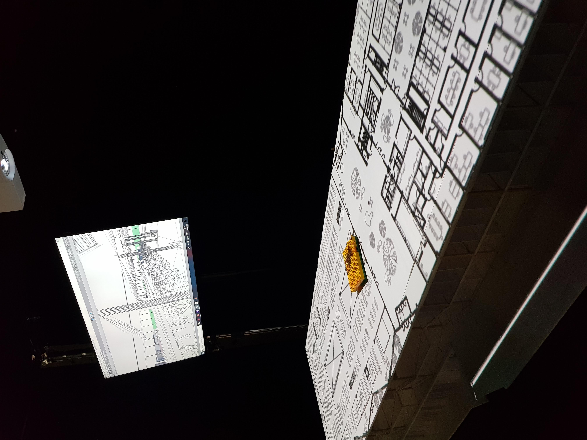
  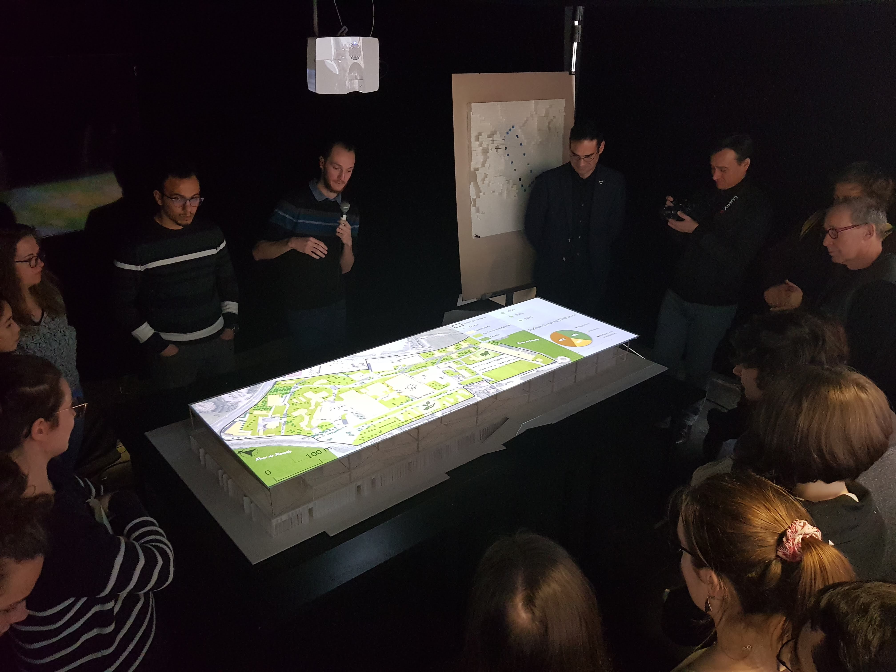 
  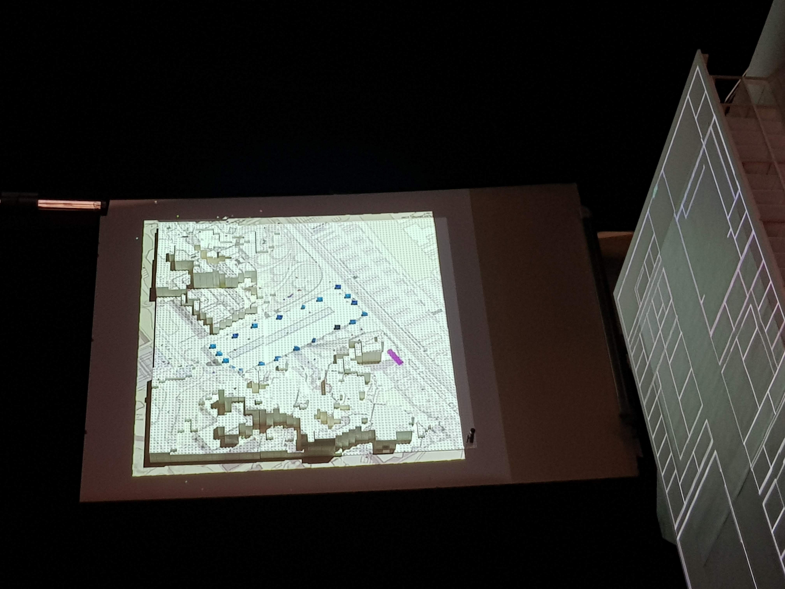
  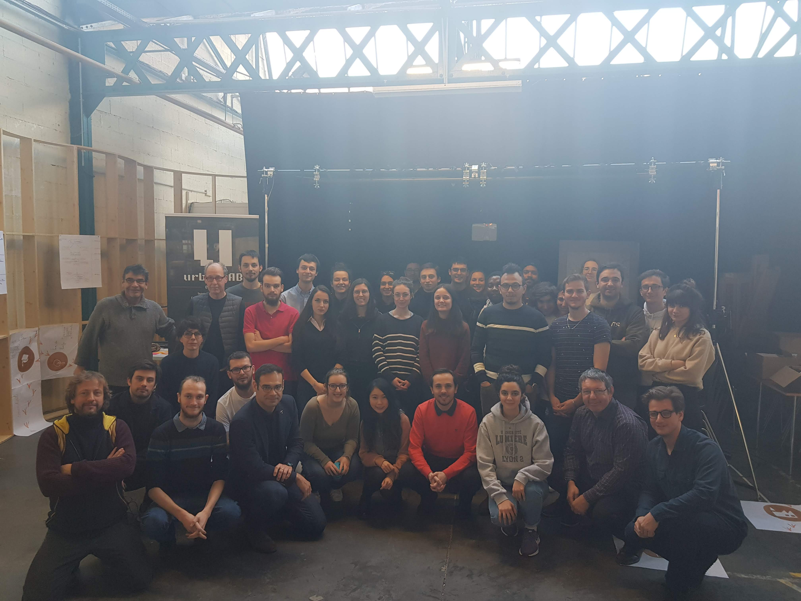

### Prototype 3 : Dispositif d'Expérimentation Mobile (LEM) 
Ce dispositif est en cours de construction en collaboration étroite avec le laboratoire des Usages de la métropole de Lyon.