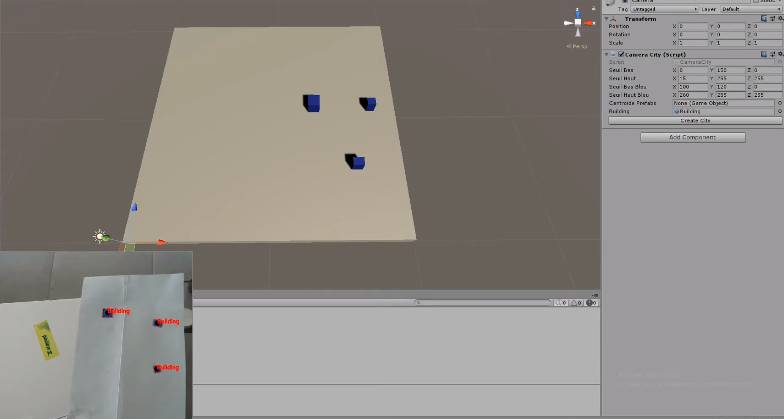
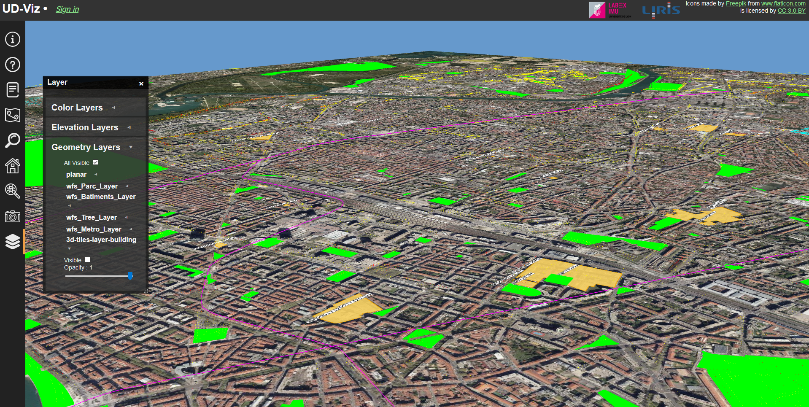

## Work in progress
- add avalaibles components (short description and link towards github code part)

 - List of already developed components
 - List of work in progress components (input point for student work).
    - [[Création de Dashboards|ECL_Dashboards]]

# Stations presentation

We propose a variety of stations to help fullfil the needs we encountered during our projects. We have developped them with our partners and documented them to provide both use and replication instructions. 

## Physical stations

### Model Display 

The technical device is made up of several elements, starting with the table in its centre on which the model is placed. It is surrounded by an iron frame to which the various elements are attached to enrich its use: 
* a video projector
* a camera
* a display screen
* a control screen
* light projectors

Collaboration with Didier Chanfray ([LabEx IMU](https://imu.universite-lyon.fr/))

***

## Software stations

### Legonizer
This module uses Unity to provide a 3D model and building instructions for a voxel representation of a custom 3D object chosen by the user.

[Learn more](Legonizer_module)

[Source Code](https://github.com/VCityTeam/DatAgora/tree/master/Lego-city-counter)
***
### City block
This module parse the urban data CityGML. It make the city in 3D on Unity so you can visualize it. The gml file is transform in object with all data needed for the creation of teh city in the Scene. Then a triangulation is make to build the city. 

[Learn more](Unity_GML_Parser_module)

[Source Code](https://github.com/VCityTeam/DatAgora)
***
### Mire 
Recognition of blue rectangles (Buildings) and transform it in 3D on Unity. This module processing images to recognize on a white paper, blue rectangles that will simulates building on a future model. This buildings are integrate in a 3D view and you can move around it.
[Exemple of use case ](https://www.youtube.com/watch?v=AbVM-ZPWpCQ)  

[Learn more](Mire_module)

[Source code](https://github.com/VCityTeam/DatAgora/tree/master/RecognitionCity)
***
### Data Viewer
A web tool to visualize and interact with custom data layers.

[Learn more](Data_Viewer_Module)

[Source code](https://github.com/VCityTeam/UD-Viz)
