## Données et traitements réalisés
Cette page reprend les données utilisées ainsi que les traitements effectués.

  * Fond de carte (Ortho 2018 8CM)

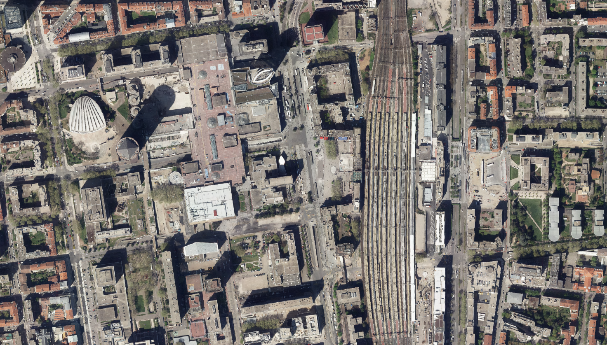

  * Espace Végétalisés et Artificialisés (2015). Cette couche contient des informations sur la taille de la végétation (à compléter)
  * Couche EVA2015_3STR : La végétation

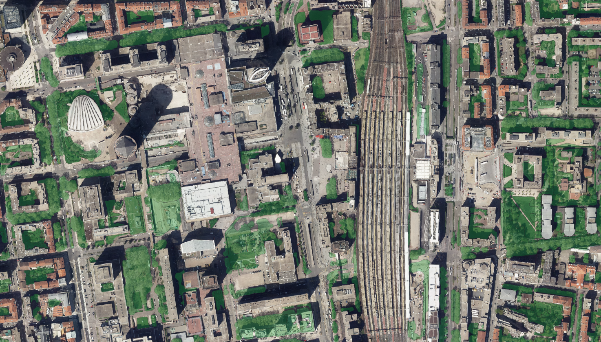

  * Couche EVA2015_Artif_sols_nus : la partie artificielle (potentiel végétalisable)

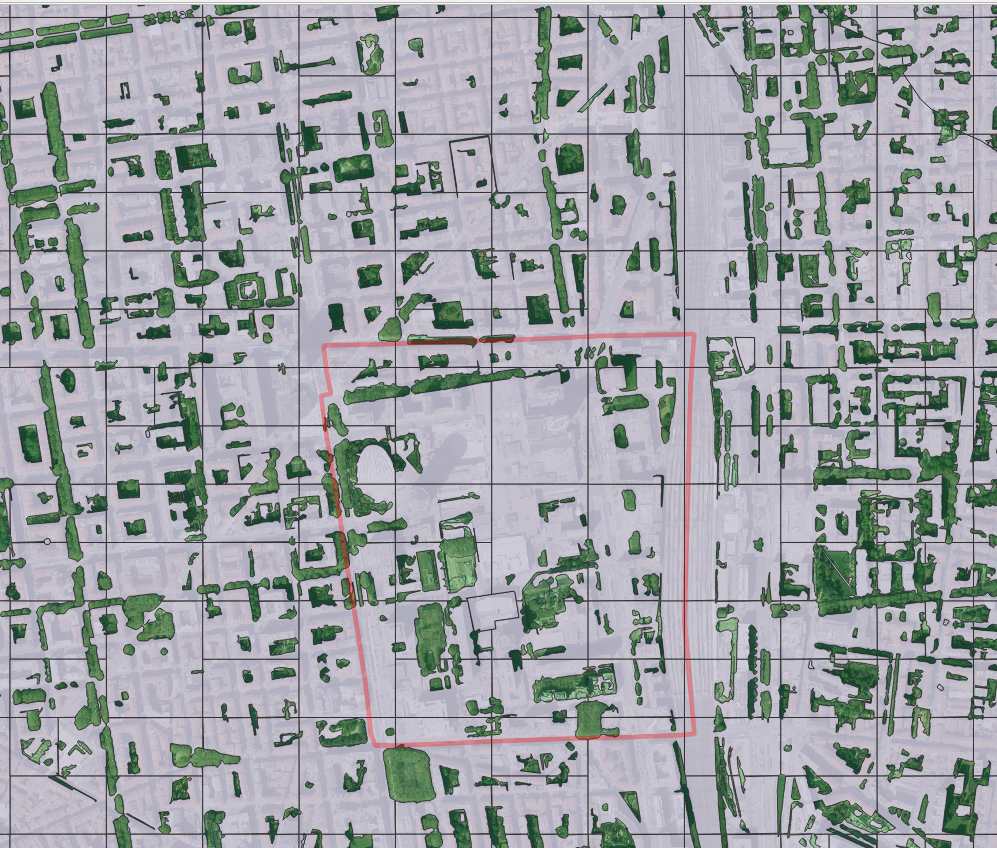

  * Couche Cadastre cadbatiment

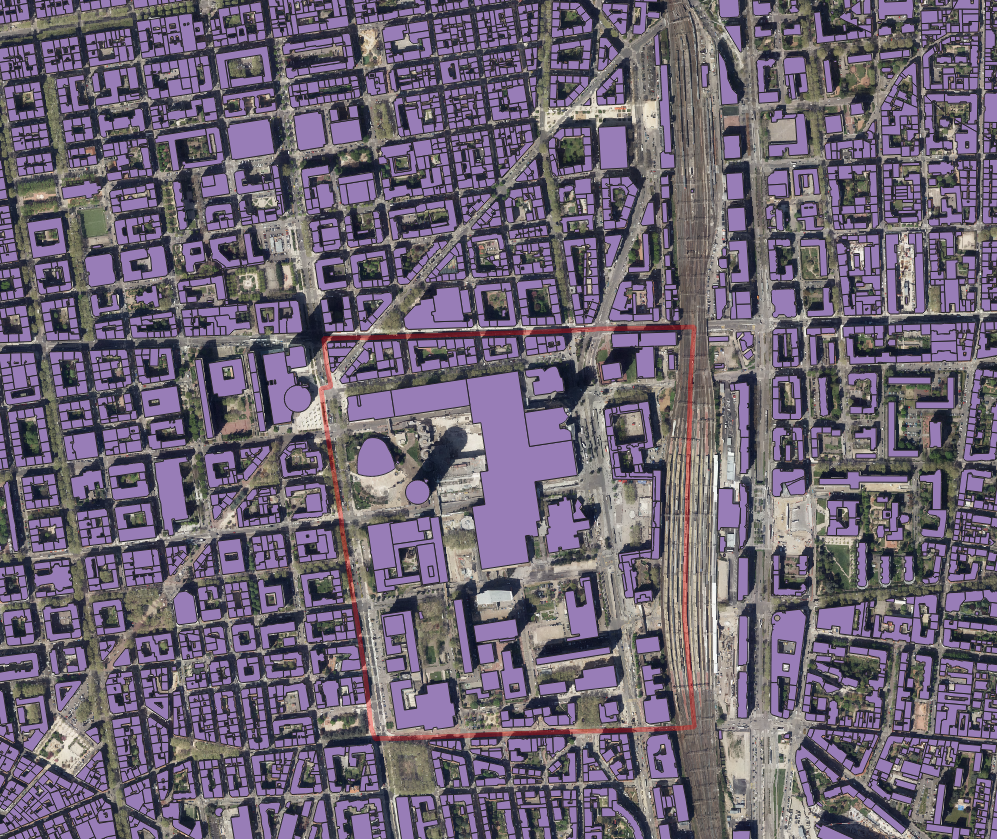

  * ms:pvo_patrimoine_voirie.pvochausseetrottoir : chaussée et trottoirs - création d'un buffer dépendant du champs largeurroute : couche pvo_ChausseeTrottoir_Buffer_LargeurRoute

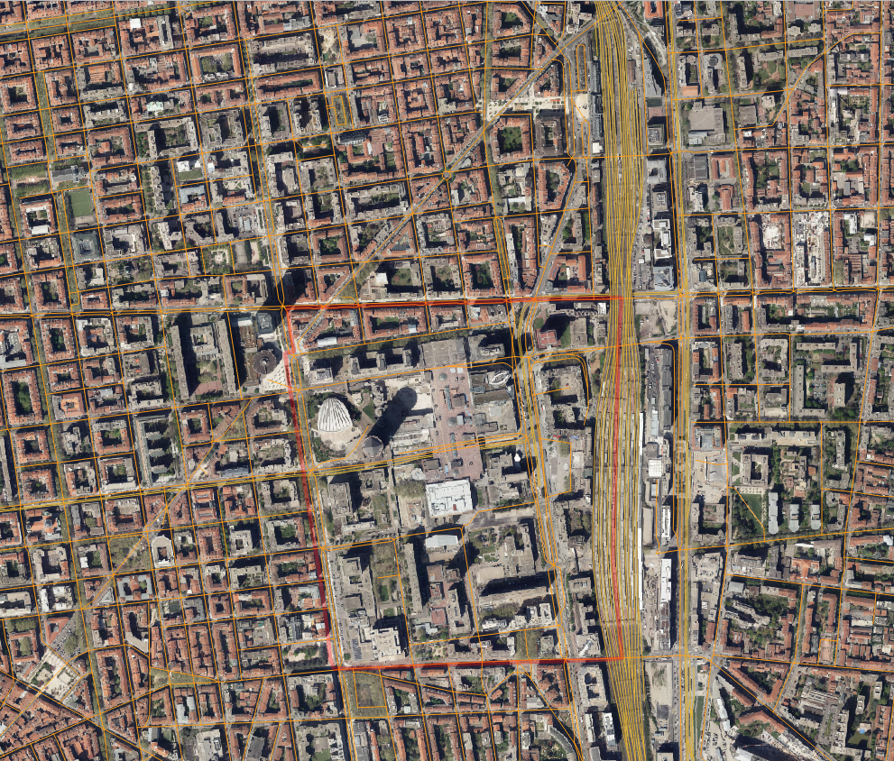
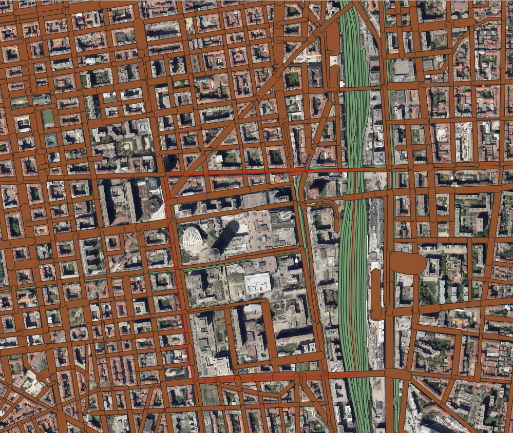

  * ms:abr_arbres_alignement.abrarbre : Arbres d'alignements déjà compris dans EVA 2015
  * ms:com_donnees_communales.comparcjardin_1_0_0 : parcs et jardins : déjà compris dans EVA 2015
  * Pourcentage de végétation à l'IRIS

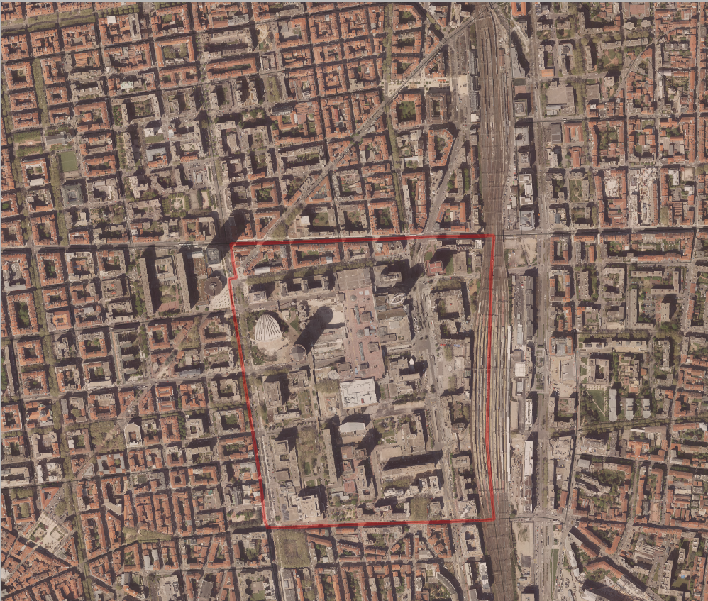
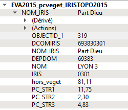

  * Calcul du masque de plantabilité
    * Remarque : Le calcul est inexact car il y aurait des géométries invalides dans la couche EVA2015 ou Cadastrebatiment. 
  * Le premier traitement consiste à soustraire des sols artificialisés les bâtiments.

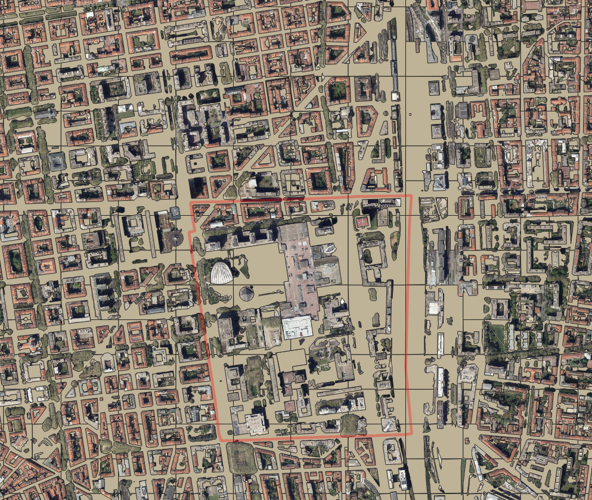

  * Enlever les éléments liés à la sncf (gares, voies, ...)

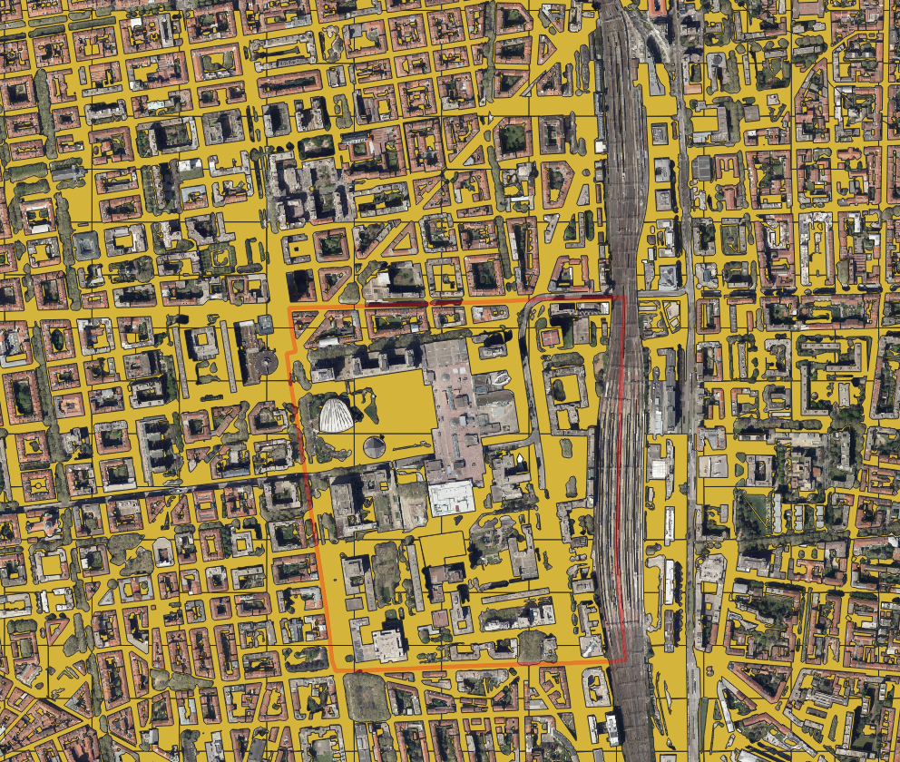

  * on enlève ensuite le buffer correspond aux routes

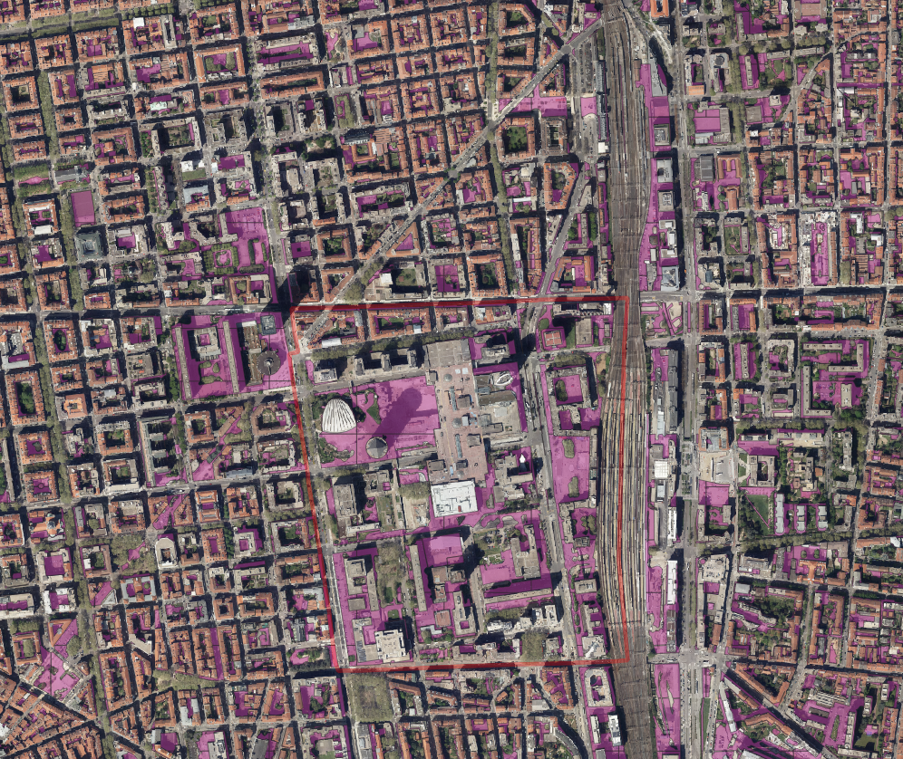

  * on soustrait ensuite les éléments sous-terrains bufferisés

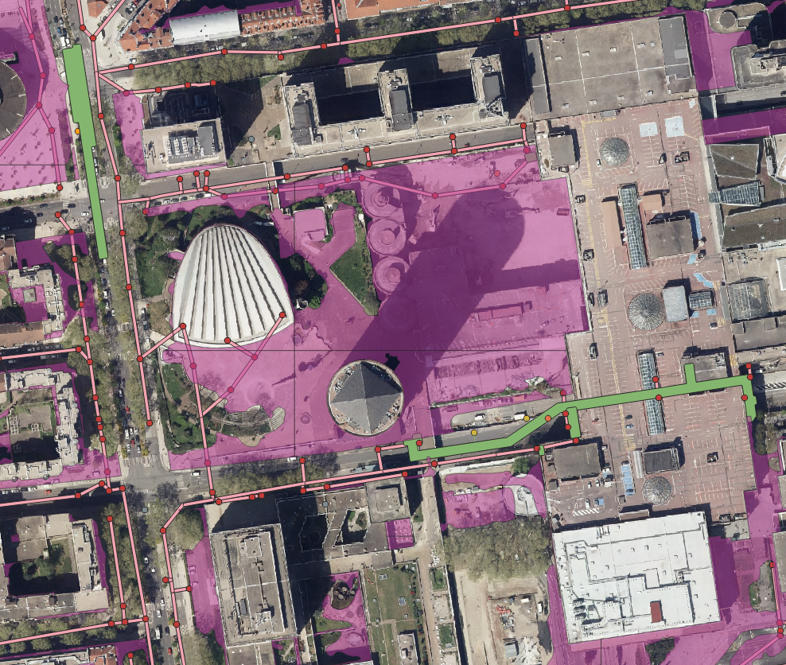

# Eléments descriptifs
Sur EVA
  * arborée, pour la végétation de plus de 3 mètres de haut ( = STRATE 1)
  * arbustive, entre 1 et 3 mètres de haut (= STRATE 2)
  * herbacée, inférieure à 1m (=STRATE 3)

  

  
