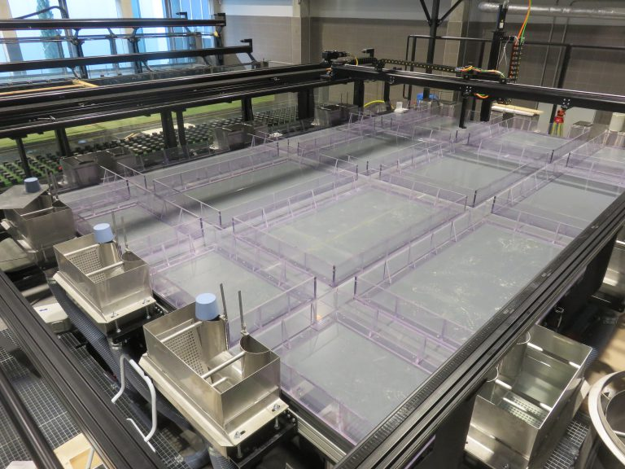
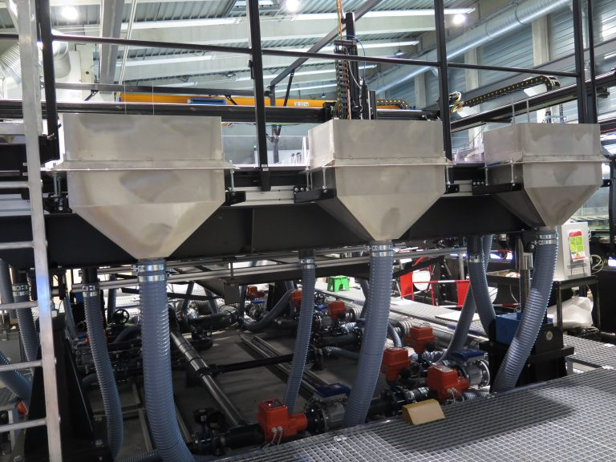

## Introduction
The experimental model is a model on which physical phenomena are applied in order to simulate scenarios visible in the world. These experiments allow the collection of data, via sensors, which will be analyzed for scientific projects, urban planning...  For example, we can simulate flooding phenomena on a miniature village in order to observe if the water flow is correct.  

### Urban Model for Flood Risk Assessment (MURI)

The [Urban Model]() for Flood Risk Investigation (MURI) was built in 2017. It is a 5.4 m x 3.8 m platform that can tilt from 0 to 5% in the longitudinal and transverse directions. It is supplied with water from 3 upstream stilling tanks, and is also equipped with 3 downstream outlet tanks, and 6 side tanks that can function either as inlets or outlets. The geometric configuration currently being studied consists of 3 longitudinal streets and 3 transverse streets, which delimit 16 rectangular building blocks. At the lower level, the platform is also equipped with pipes (parallel to the streets) that model the sewerage network and that can be connected vertically to the streets (gully models).

