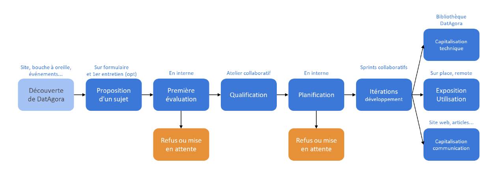

# Our methodology

For each project we work on, we follow a rigorous methodology, based on data processing and validation, in close collaboration with all project contributors, to ensure that everyone agrees with the current developments, and thus ensure the success of the project.

The first of these steps is to evaluate the project proposal as a whole. This involves defining its aspirations, delineating its scope, and clearly identifying all the components that will be necessary for the successful implementation of the project. Following this study, the project can be pursued if it is sufficiently precise and corresponds well to DatAgora's field of work.

One or more collaborative workshops are then organized to qualify the different components of the project, in which all the partners affiliated to the project participate, in order to share their expertise. During these workshops, everyone exchanges around the installation modalities, the data to be mobilized and the means to interact. Following this, a first planning is established, and the development process begins.

We proceed by working iteratively on the different components of the project by operating a regular weekly on the different productions, whether hardware or software. At the same time, we establish a documentation of the work done, and communicate on the different progresses of the project. These iterations are planned to be able to also participate in different key events for the project.
