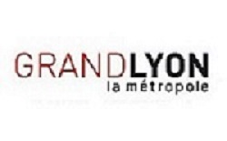
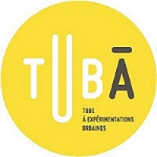

# Partners

|Lyon University|Lyon Metropolis|Collaborating Institutions|
|:-:|:-:|:-:|
|  [Vers la page DatAgora ASLAN](http://icar.cnrs.fr/datagora/)||
|  [Vers la page DatAgora Erasme](https://www.erasme.org/DatAgora)|

