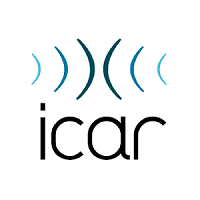

# Partners

## Lyon University

| ||
|:-:|:-:|

|[Vers la page DatAgora ICAR](http://icar.cnrs.fr/datagora/)||
|:-:|:-:|

## Lyon Metropolis

||  [Vers la page DatAgora Erasme](https://www.erasme.org/DatAgora)|
|:-:|:-:|

## Collaborative Institution 

