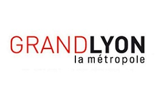

# Partners

### Lyon University

|[ASLAN](https://aslan.universite-lyon.fr/)|[Labex IMU](https://imu.universite-lyon.fr/)|[LIRIS](https://liris.cnrs.fr/)|
|-|-|-|
||||

***

### Lyon Metropolis

|[GrandLyon](https://met.grandlyon.com/data-grandlyon/)|[Erasme](https://www.erasme.org/-UrbanLab)|
|-|-|
|||

***

### Collaborating Institutions

|[Tuba](http://www.tuba-lyon.com/)|
|-|
||

# Related Pages

[DatAgora Erasme](https://www.erasme.org/DatAgora)
