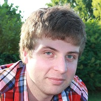
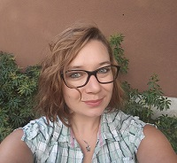
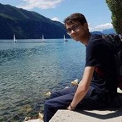
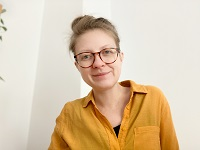
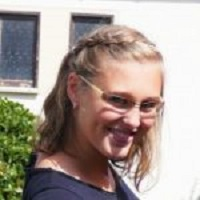
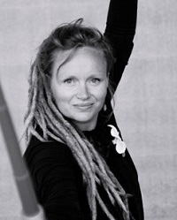
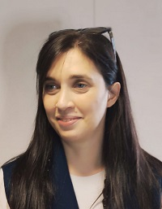

# DatAgora Team

| **[Gilles GESQUIERE]()**   Co-director of DatAgora project  Head of Vcity project  Professor  Labex IMU   (since 2013)| |
| :-----: | :---:|
|| **[Kris LUND](http://www.icar.cnrs.fr/membre/klund/ )   Co-director of DatAgora project   Director of the Laboratory of Excellence ASLAN  Research engineer   (since XXXX)**
|| **[Didier CHANFRAY]()**   Serious game & video games animator  of LabEx IMU  (until Feb. 2022)|
| **[Antoine WEBANCK](http://webanck.fr/)**   Research Engineer   Labex IMU  (Mar. - Dec 2021)| |
|| **[Laurène SMYKOWSKI](https://www.linkedin.com/in/laurene-smykowski-552a05a8/)**   Project Engineer  Labex ASLAN  (Nov.2020 - Dec 2021) |
|**[Corentin GAUTIER](https://github.com/CorentinGaut)**   Engineer Internship   Labex IMU (May - Sep. 2020)| |
|| **[Homère BOURGEOIS]()**   Developement Engineer   Labex IMU (June. 2020 - Jul. 2021)|
|**[Elizaveta CHERNYSHOVA](https://www.linkedin.com/in/echernys/)**   Research Engineer   Labex ASLAN   (Nov. 2020 - Mars 2021) ||
|**[Lydia HEIDEN](http://www.icar.cnrs.fr/membre/lheiden/)**   Project Engineer   Labex ASLAN|
|**[Séverine DEROLEZ](https://www.linkedin.com/in/s%C3%A9verine-derolez-494852129/)**   CNRS postdoctoral researcher  Labex ASLAN   (Sept. 2021 - Sept. 2022) ||
||**[Nadia DARIO](https://www.researchgate.net/profile/Nadia-Dario-2)**   Labex ASLAN postdoctoral researcher  ASLAN   (Sept. 2021 - Sept. 2022) |