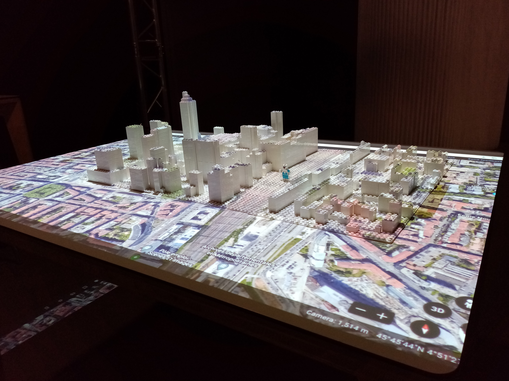
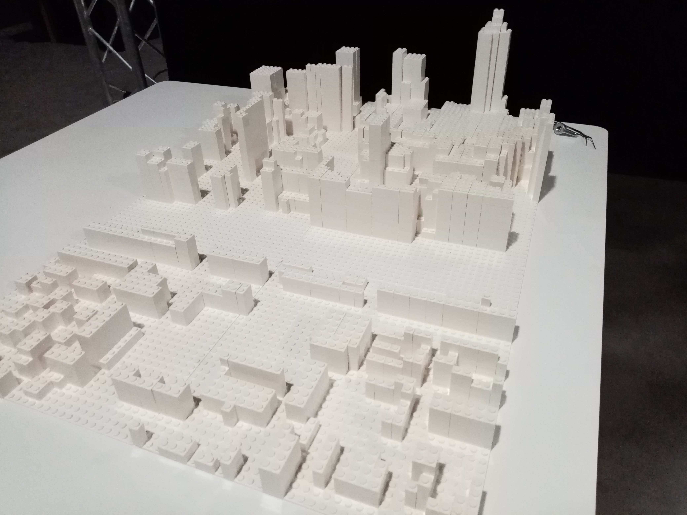
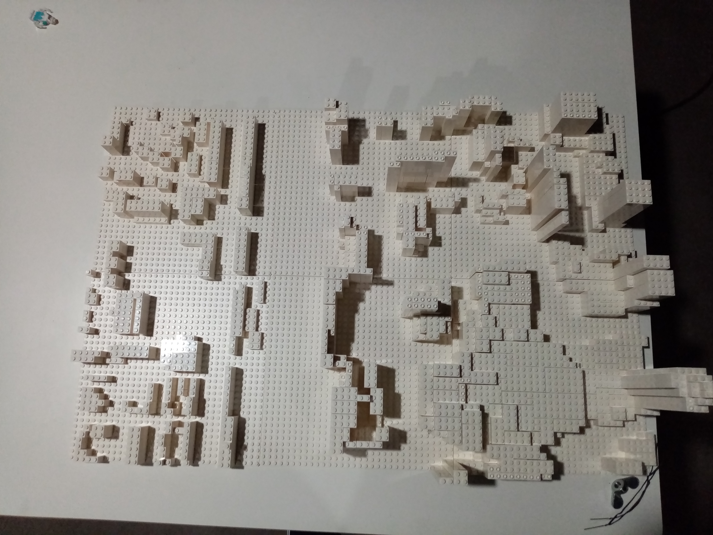
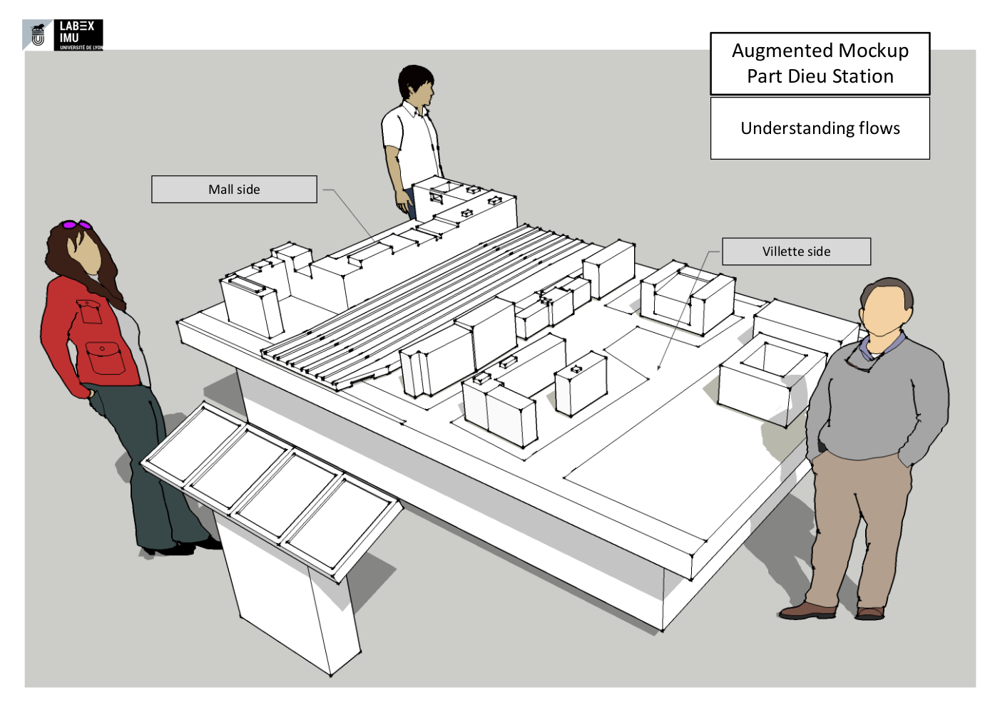
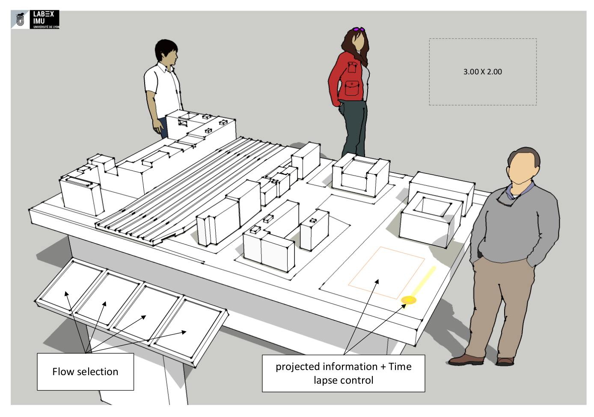
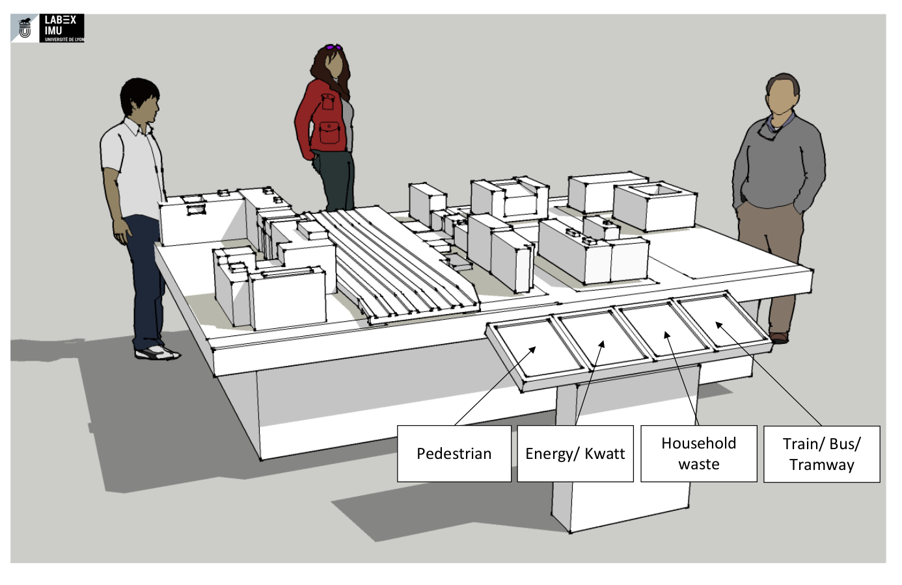
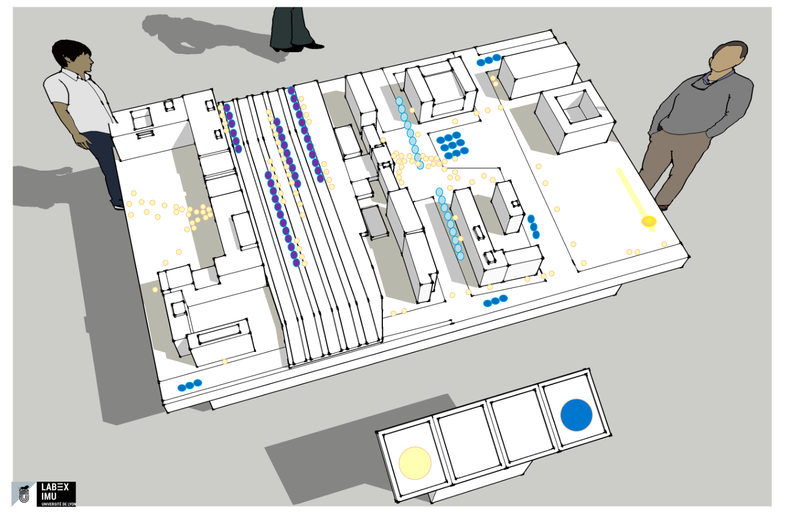
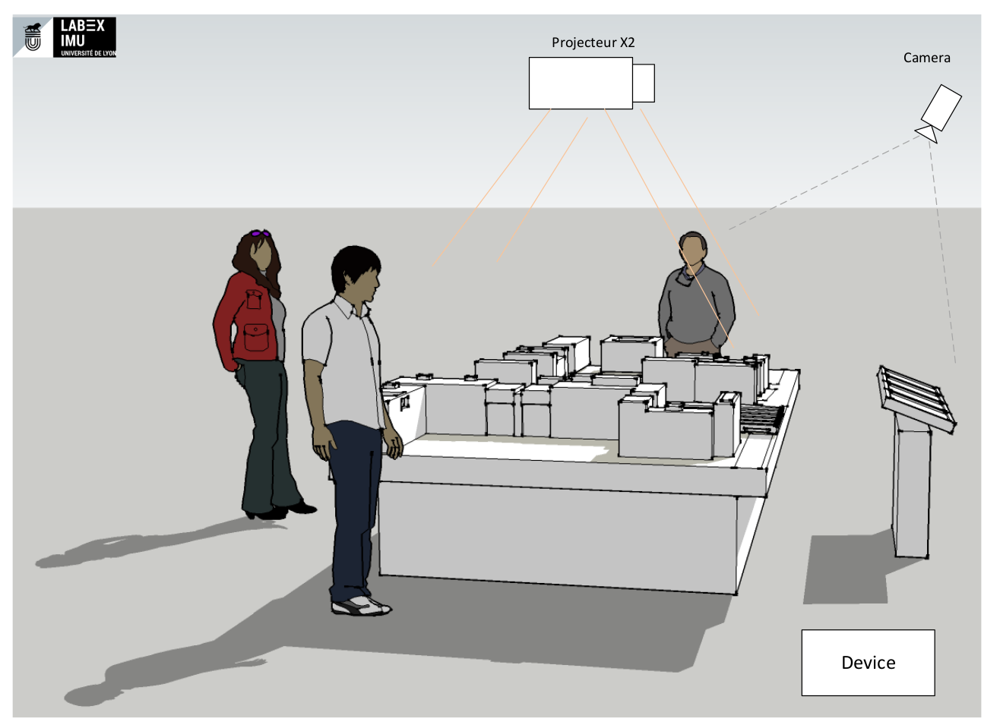
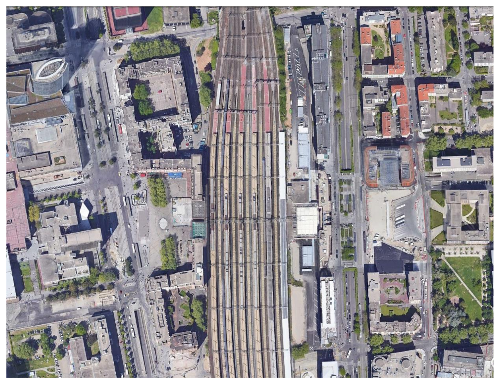

## Modules used
 * Already in use
   * [CityBlock](Unity_GML_Parser_module) : Parser GML, we take the 3 rd arrondissement, more precisely the Part dieu district
   * [Legonizer](Legonizer_module) : Help us to create the model in lego, with raycast that we throw on the 3r arrondissement CityGML and create a excel file wich is a simple matrix with the height on the coordinate x, y
   * [Mire](Mire_module)
   * [Data Viewer](Data_Viewer_Module)
   * tangible table
* In process
  * Providing a tangible table (to facilitate the interaction between stakeholder and help possible decisions)
  * [Providing necessary data crossing and geoprocess to understand the possible place of vegetation in public and private space](Data_vegetation_process)Providing necessary data crossing and geoprocess to understand the possible place of vegetation in public and private space)
  * Studying possible use of gamification in the topic of vegetation and urban spaces.

## Features
We downloaded the open data of the [3rd arrondissement](https://data.grandlyon.com/jeux-de-donnees/maquette-3d-texturee-lyon-3e-arrondissement-metropole-lyon/info) of Lyon in GML file. Then with the module [CityGMLParser](https://github.com/VCityTeam/UD-CityGMLParser) we integrate this data in Unity to visualize it.

  
During the first use of these modules we have prototyped different models by changing the scale of the city legolizer to find the best compromise between the available space and the level of detail of the lego model to recognize the neighborhood and then be able to place green legos to simulate trees and be recognizable by the camera for the "recognition" module.

### Tested scales
[Test 1](Test_1_vegetalisation_project)    [Test 2](Test_2_vegetalisation_project)

 
 

## Illustrations
<!-- [Illustrations sources](Mockup_PartDieu.pdf)  -->

_a sketch of a possible installation for the model_
