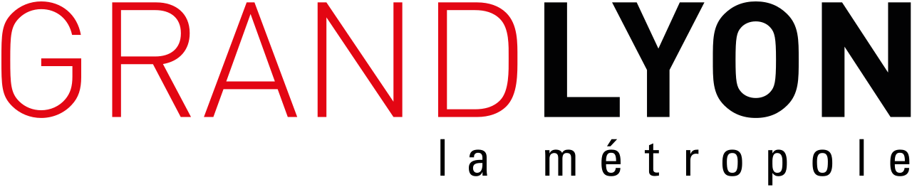
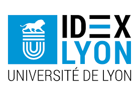

# DatAgora : Un programme joint de l'Université de Lyon et la Métropole de Lyon

***

|||
|-|-|

### Contexte

La prise de décision politique, économique ou sociale doit de plus en plus s'appuyer sur des données tout en mobilisant une approche interdisciplinaire. Le volume des données reste bien sûr un défi (données de grande taille) mais la nature multi-sources est également importante pour trouver le bon ensemble de données, l'associer à celles qui existent déjà et l'enrichir avec une modélisation et un apprentissage adaptés à un domaine donné. Il s'agit d'un défi scientifique, technique, organisationnel et humain. La complexité et la diversité des données signifient également que nous devons atteindre une échelle appropriée en termes de traitement, de visualisation et de capacités de collaboration autour de ces données. Ainsi, des initiatives ont déjà été proposées dans le passé, à l'échelle internationale, mais aussi en France, pour créer des lieux dédiés aux données et à leurs représentations. Il s'agit généralement de très grandes infrastructures. 
Dans l'approche proposée ici, nous mobilisons les données dans des processus d'aide à la décision, qui nécessitent une compréhension et une contextualisation préalables. A court terme, nous voulons créer un nouveau lieu de rencontre local autour des données. Contrairement aux approches proposées dans CAVE (environnements immersifs), nous choisissons de travailler sur des dispositifs peu coûteux qui peuvent être facilement dupliqués en plusieurs endroits, et installés rapidement de manière simple. 

### Objectif

 L'objectif est de donner la possibilité de mobiliser les données et de proposer différentes modalités de visualisation. Il s'agit également d'observer et de mettre en œuvre de nouvelles méthodes de médiation des données, ou d'observer cette médiation. Il est alors nécessaire de fournir de nouveaux outils (numériques) pour aider dans ces processus de médiation. 
L'originalité des approches est que les groupes de chercheurs participant au réseau sont issus de plusieurs disciplines, ce qui permet un croisement des expertises scientifiques autour d'un même dispositif. Ils fournissent également de nouveaux moyens de médiation des données avec des expériences basées initialement sur des travaux de recherche (modélisation, visualisation, médiation, sciences des données, etc.) ). En rendant ces expériences disponibles dans un lieu physique, ils ont permis de réunir des experts (en mobilité, par exemple) et de les faire échanger sur les scénarios proposés, tout en rendant transparentes les considérations techniques préalables.

### Cible
Le public cible est assez large. L'objectif est de permettre aux étudiants, aux chercheurs ou aux enseignants de mobiliser les salles pour être des utilisateurs, des experts ou des développeurs de nouvelles stations. Le choix de traiter les problèmes de manière multidisciplinaire permet de faire appel à des experts en SHS, SPI ou en sciences de l'environnement. Le déploiement d'une salle dédiée à la métropole lyonnaise (Urban Lab Erasme) ou aux entreprises est actuellement à l'étude. Les expériences réalisées devraient également servir à accroître la visibilité du site, ainsi qu'à des activités de vulgarisation scientifique. Par exemple, il serait possible de concevoir des animations telles que "données et vie privée", "données et mobilité", "interactions de rencontre", etc.

