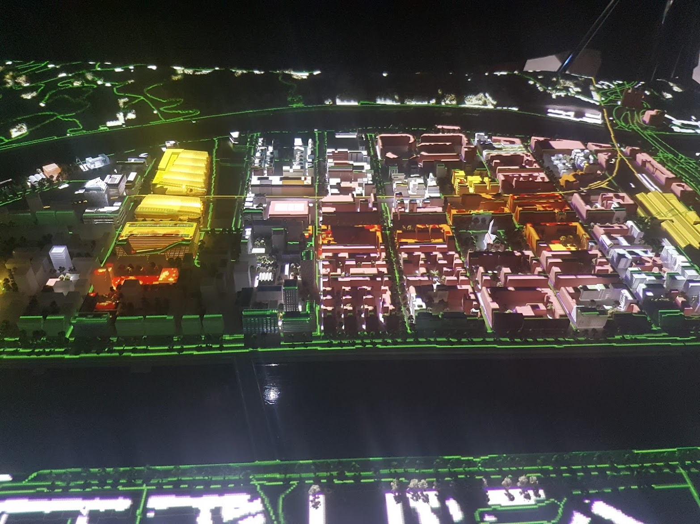

# DatAgora: A joint programme of *Université de Lyon* and *Métropole de Lyon*

***

|||
|-|-|

### Context

Political, economic or social decision-making increasingly needs to be based on data while mobilizing an interdisciplinary approach. Data volume remains of course a challenge (big data) but the multi-source nature is also important in order to find the right set of data, associate it with existing ones and enrich it with modelling and learning adapted to a given field. This is a scientific, technical, organizational and human challenge. The complexity and diversity of the data also means that we need to reach an appropriate scale in terms of processing, visualization and collaboration capabilities around such data. In this way, initiatives have been already proposed in the past, internationally, but also in France, to create places dedicated to data and their representations. These are generally very large infrastructures. 
In the approach proposed here, we mobilize data in decision support processes, which require prior understanding and contextualization. In a short terme, we want to create a new local meeting place around data. Contrary to the approaches proposed in CAVE (immersive environments), we choose to work on low-cost devices that can be easily duplicated on several place, and installed quickly in an easy way. 

### Objective

The objective is to give the possibility to mobilize the data and to propose different visualization modalities. It is also a question of observing and implementing new methods of data mediation, or observation of this mediation. Then it is necessary to provide new (numerical) tools to help in these mediations processes. 
The originality of the approaches is that the groups of researchers participating in the network come from several disciplines, allowing a cross-fertilization of scientific expertise around the same device. They also provide new means of data mediation with experiments based initially on research work (modelling, visualisation, mediation, data sciences, etc.). By making these experiments available in a physical location, they have made it possible to bring together experts (in mobility, for example) and to have them exchange ideas on proposed scenarios, while making the preliminary technical considerations transparent.

### Target
The target audience is quite large. The aim is to allow students, researchers or teachers to mobilize the rooms to be users, experts or developers of new stations. The choice to deal with problems in a multidisciplinary way means that experts in SHS, SPI or Environmental Sciences can be called upon. The deployment of a room dedicated to the metropolis of Lyon (Urban Lab Erasme) or to companies is currently under consideration. The experiments carried out should also be used to raise the visibility of the site, as well as for scientific popularisation activities. For example, it would be possible to design animations such as "data and privacy", "data and mobility", "meeting interactions", etc., using the stations.

