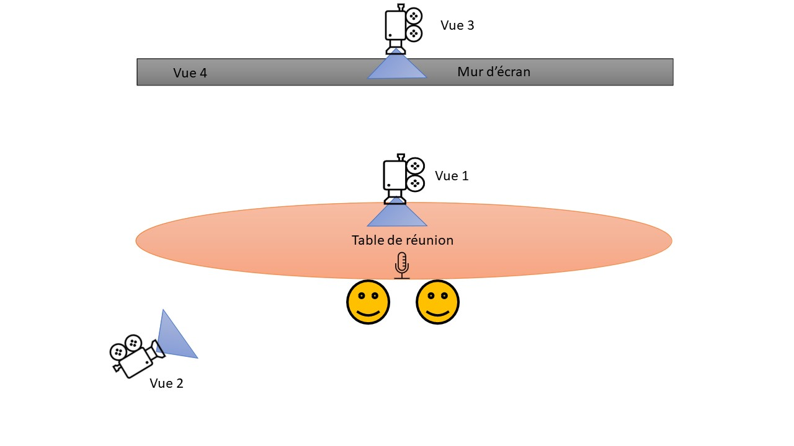

||||
|---|---|---|---|

# Dispositif de collecte de données fixes

>*Based on EMCA (Ethnomethodological conversation analysis) methodology, this recording device is suitable to collect interactional audio-video data. Especially for static interactions.*

Schéma du dispositif d'enregistrement fixe

***

Le dispositif d’enregistrement est le suivant : 
- Deux caméra trépied :
  - face participants  + micro caméra (vue 1)
  - dos participants + visualisation écran + micro caméra (vue 2)
- Une prise de vue vidéo à partir de la caméra fixe de la barre de son + micro table  (vue 3)
- Capture d’écran continue + micro intégré à l’ordinateur  (vue 4)
- Enregistrement des traces numériques

***

### Projects
- [ICAR](http://icar.cnrs.fr/)

### Involved partners
- [ICAR](http://icar.cnrs.fr/)

