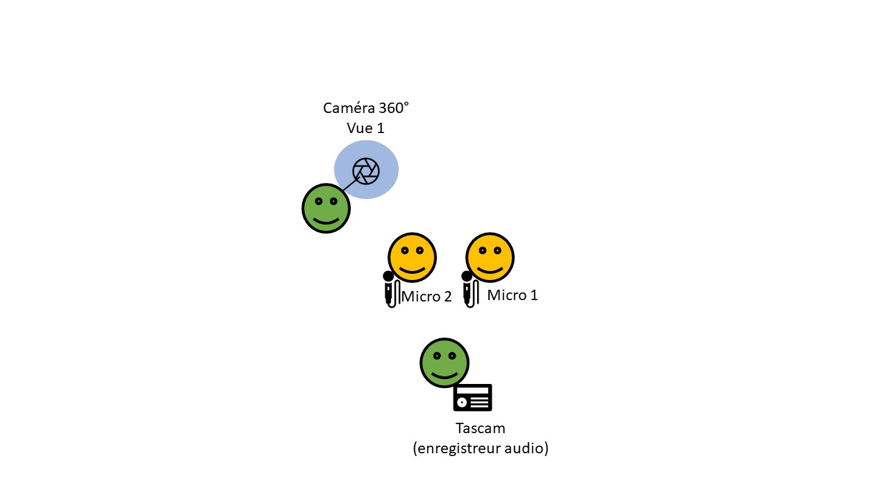

||||
|---|---|---|---|

# Dispositif de collecte de données mobiles

>*Short and accessible description.*

Schéma du dispositif d'enregistrement mobile

Le dispositif mobile mis en place est constitué 
- d’une caméra 360 tenue par l’un des expérimentateurs
- de deux micros-cravate positionnés sur les participants
- d’un récepteur-enregistreur audio (Tascam) récoltant les entrées son des micros des participants. 

Une trace GPS du parcours des participants sera aussi réalisée.

***

### Projects
- [GUIDE](/projects/project_Guide)

### Involved partners
- [ICAR](http://icar.cnrs.fr/)

