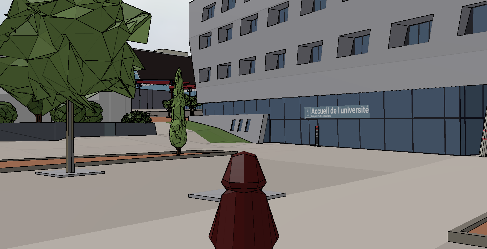

||||
|---|---|---|

# Bron Wandering
2021

>*A web application allowing third person and human scale wandering in a digital mockup of the Bron campus.*

***

||||
|---|---|---|

This web demonstration put you in control of an avatar wandering in the digital mockup, and following a fictive student schedule.
You can find a live version of the demonstration [here][demo].

**Quick start:**
* The avatar is currently controlled with the keyboard keys `ZQSD` (French mapping).
* Contextual instructions are displayed at the upper left corner of the demonstration.
* The avatar spawns far from the campus, in an empty area ; to start the wandering (and the clock), press the `M` key.
* Orientation tables are scattered throughout the campus and a map is displayed when the avatar stands close those tables.
* The current objective of the student schedule is validated when the avatar reaches its area, and the next objective is revealed.
  There are 10 objectives in total, and when finished, the resulting time is displayed, and the log of the wandering (the trace of the track) can be downloaded by pressing key `T`.

***

### Projects
* [GUIDE](/projects/project_Guide)

### Involved partners
* ASLAN/ICAR

### References
[demo]: https://deambulation-bron.vcityliris.data.alpha.grandlyon.com/

* [GitHub repository](https://github.com/VCityTeam/UD-Demo-DatAgora-Deambulation-Bron)
* [Online demonstration][demo]
