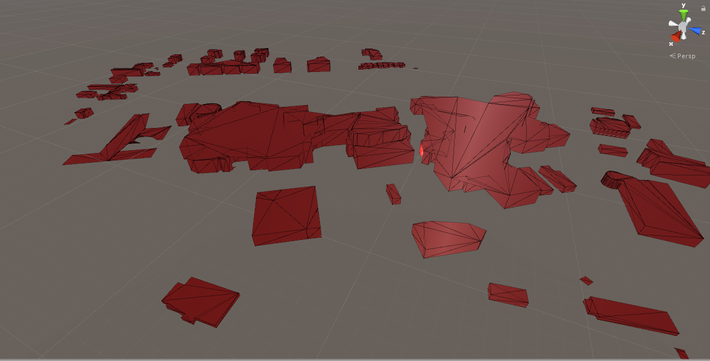

||
|---|

# CityGML Parser
2020-2021

>*Unity module to parse and visualize CityGML urban data as a triangle mesh.*

***

This component consists of a set of scripts allowing the user to rebuild a one or more building from a GML file. It uses an ear-cutting algorithm to create a convex mesh of the buildings by parsing the point positions from the input file. It is an editor script, meaning you do not have to enter Unity playmode to obtain your results, and you can freely use them in your scene after you built your mesh. There are also solutions to export your mesh in a FBX file to get it out of Unity afterwards.

***

### References
* [GitHub repository](https://github.com/VCityTeam/UD-CityGMLParser)
