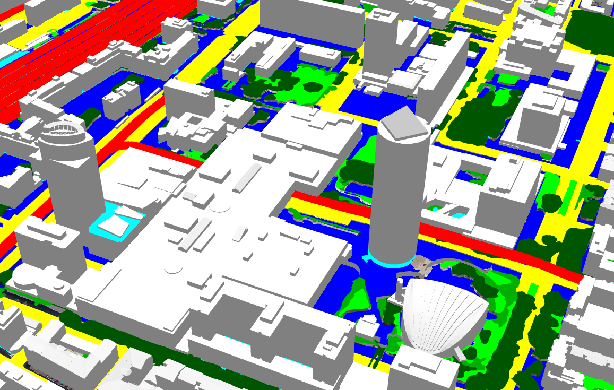

||||
|---|---|---|

# Data Viewer
2020-2021

>*A web tool to visualize and interact with custom data layers.*

***

|||
|---|---|
|||

A web application that allows us to display data in a 3D environment and interact with it to better showcase the correlations between them. This module is part of a large web application, [UD-Viz](UD-Viz_module), developed at LIRIS by the VCity team. UD-Viz is based on ITowns, a Three.js environment to display geospatial data, and is constantly enhanced by adding various modules to better analyze and interact with data.

The data is retrieved from databases with WFS or WMS protocol and processed to best fit the user's requierments.

## Current features
* Load data from file
* Modify it's color according to file data
* Filter Data
* Hide data layer in view, or change it's opacity
* Change objects shapes (not available for 3d points yet)

## Available data formats
There are several supported formats that can be dislpayed, either as 3D objects or rasterized. Using [Geoserver](http://geoserver.org/), we are able to store datasets remotly, and access them in various formats.

### 3D objects
* GeoJSON
* 3D Tiles

### Raster
* GeoJSON
* JPG
* PNG

## Web services available
* WFS
* WMS

***

### Projects 
* [Place of Vegetation in cities](/projects/cities-vegetation)

### References
* [GitHub repository](https://github.com/VCityTeam/UD-Demo-DatAgora-Vegetalisation-PartDieu)
* [Online demo](https://datagora.vcityliris.data.alpha.grandlyon.com/)
