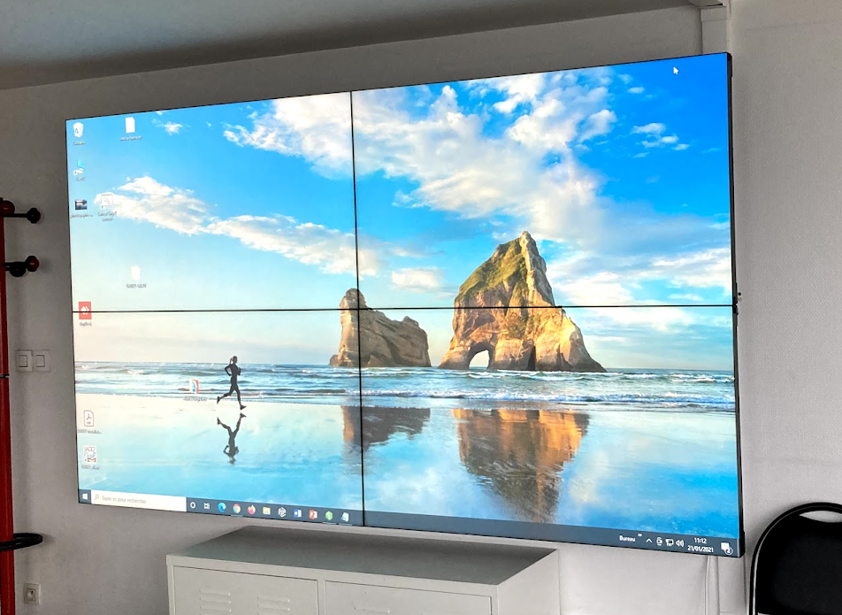

||||
|---|---|---|

# I-Screens-M  (Interactive Screens - Multiple)

2020-2021

>*The goal of the i-Screens-M project is to provide an interactive, collaborative environment to analyze complex, multi-source data produced by interdisciplinary projects at the large crossroads of language sciences, education, and computer science and to share best practices within our community.*

These projects are funded by the laboratory of excellence [ASLAN](https://aslan.universite-lyon.fr/), the [Lyon IDEX](https://idexlyon.universite-lyon.fr/), or by diverse grants obtained by the [UMR ICAR](http://icar.cnrs.fr/). By complex we mean data that is inter-related and that must be understood in its imbricated form. By multi-source, we mean synchronized data from multiple data streams, for example - audio-video corpora with transcribed dialogue and multimodal actions, in addition to associated trace data.

Our idea is that each project that uses i-Screens-M will develop new analytical practices, and that these practices can thus be shared with other projects who also seek new ways to collaboratively analyze, interpret and make decisions about complex, multi-source, interdisciplinary data.

***

### Projects
* [GUIDE](/projects/project_Guide)
* [Collaborative analyses of complex data](/projects/project_Transferability)

### Involved partners
* [ASLAN](https://aslan.universite-lyon.fr/)
* [ICAR](http://icar.cnrs.fr/)
* [IDEX Lyon](http://icar.cnrs.fr/)

### References

