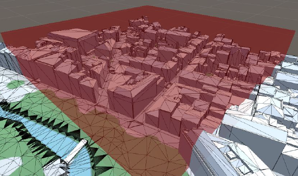

||
|---|

# Legonizer
2020-2021

>*Unity module to transform a provided 3D object into a voxel representation. Provides building instructions for a tangible construction such as with legos.*

***

### Projects 
* [Place of Vegetation in cities](/projects/cities-vegetation)

### References
* [GitHub repository](https://github.com/VCityTeam/UD-Legonizer)

