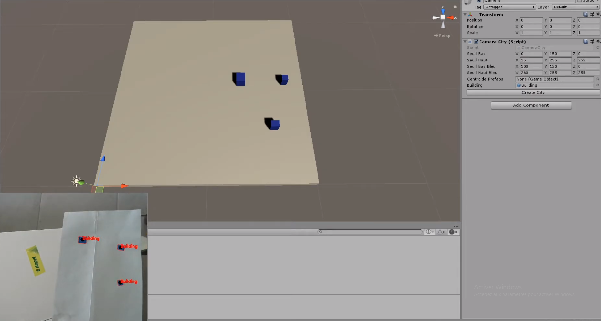

||||
|---|---|---|

# Mire
2020-2021

>*Unity module to track rectangles elements (legos) with a camera and move their digital siblings accordingly in the 3D scene.*

***

The Mire module is a camera detection Unity module based on OpenCV, and used to track real life objects and either display them in Unity, or interact with objects in the scene. Objects can be tracked thanks to their shape or color. To prevent interferences from other objects in the camera field of view, the user can configure lower and upper bounds to best match the object they are tracking. The module also tracks the rotation of the objects.

***

### Projects 
* [Place of Vegetation in cities](/projects/place-vegetation-cities)

### References
* [GitHub repository](https://github.com/VCityTeam/UD-Mire)
* [Youtube video demonstration](https://www.youtube.com/watch?v=AbVM-ZPWpCQ)
