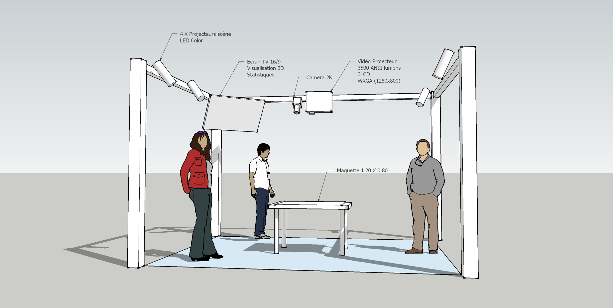

|||||
|---|---|---|---|

# Model Display
2020-2021

>*A technical device made up of several elements, starting with the table in its centre on which the model is placed. It is surrounded by an iron frame to which the various elements are attached to enrich its use.*

***

||||
|---|---|---|
||||

## Elements
* a video projector
* a camera
* a display screen
* a control screen
* light projectors

***

### Projects
* [Place of Vegetation in cities](/projects/place-vegetation-cities)

### Involved partners
* Didier Chanfray, Labex IMU
* LIRIS
* Erasme
* Tuba
