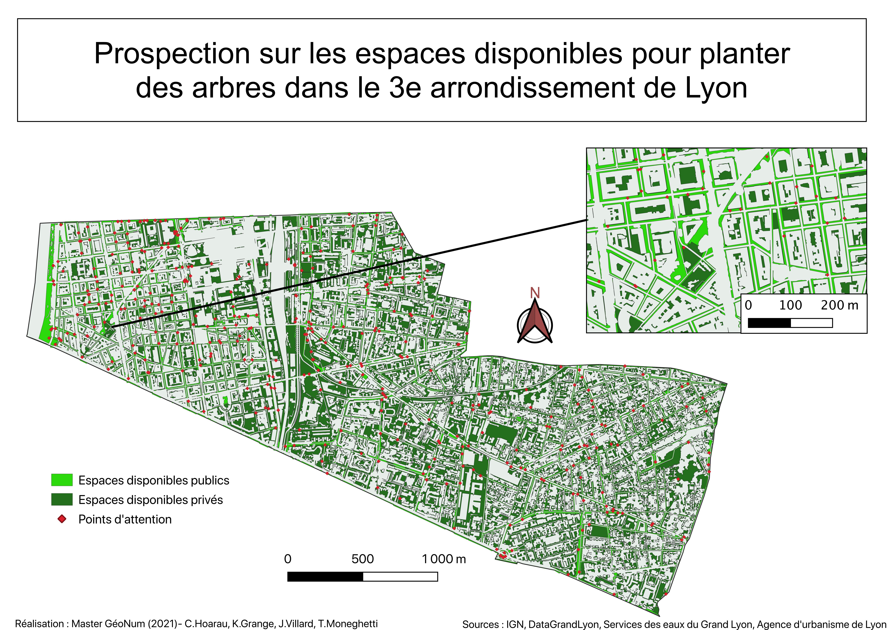
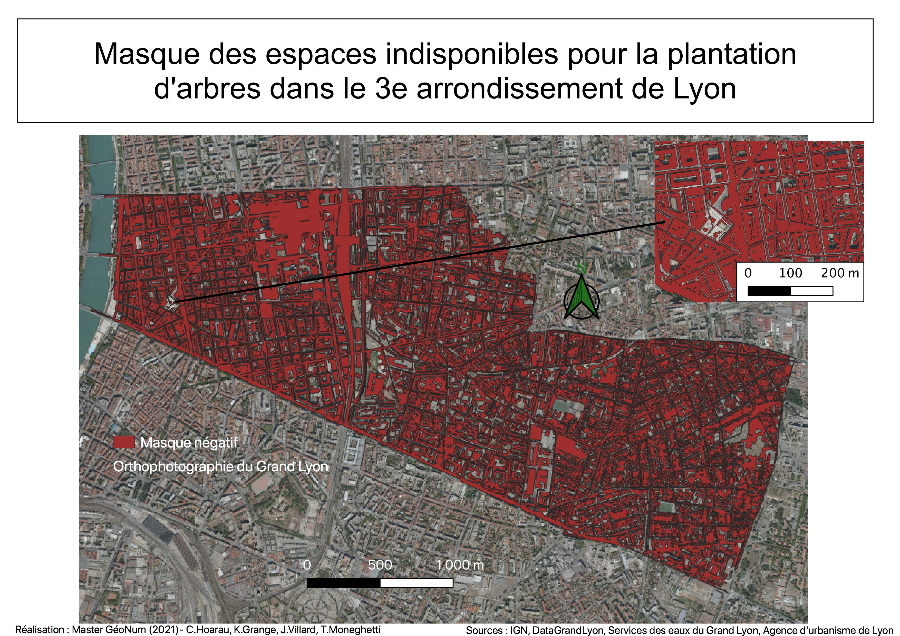

---
---

Sur cette carte, on peut voir l’ensemble des espaces disponibles pour planter des arbres. Cette première représentation nous montre la différence entre les espaces privés et publics, ainsi que l’ensemble des points d’attention. Ces points d’attention méritent une attention particulière pour une étude plus précise de la prospection, sur le terrain.

***

Cette carte est composée du masque négatif (où on ne peut pas planter d’arbres) et d’une orthophotographie de la ville de Lyon. L’intérêt de cette production est d’éliminer de notre vue les espaces où on ne peut pas végétaliser pour nous concentrer sur le masque positif. Grâce à l’image satellite, on se rend vite compte des types de lieux où les arbres peuvent être plantés, et on peut avoir une première approche pour valider ou non certains espaces.

[Page précédente - III.2 - Application de la méthodologie et géo-traitements](Geotraitements)

[Page suivante - IV.1 - Interprétation](Interpretation_resultats)
