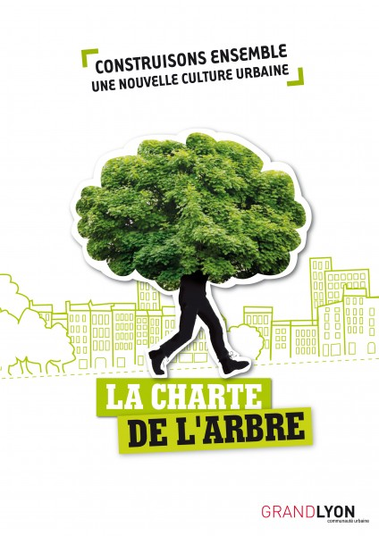
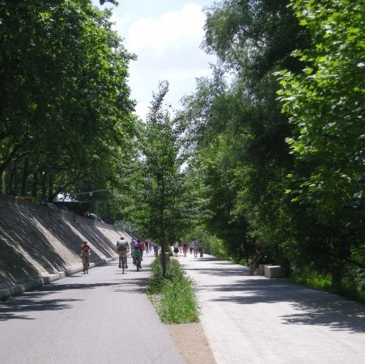

### La Charte de l'arbre

La Charte de l’arbre est un outil rassemblant l’ensemble des acteurs du territoire de la Métropole de Lyon, dont les actions, les métiers ou la sensibilité sont en lien avec la question de l’arbre en ville. Conçue de manière à constituer un support de connaissances et de principes, elle a vocation à servir de guide dans une perspective d’amélioration et d’harmonisation des pratiques, assurance nécessaire à une protection durable des arbres composant le paysage de l’agglomération.

La Charte de l’arbre s’inscrit dans un contexte où 80% de la population française est urbanisée, le Grand Lyon rassemble à lui seul 59 communes et compte un peu plus de 1,4 millions d’habitants. Si la ville moderne est devenue de plus en plus fonctionnelle au cours du 20ème siècle, les politiques de développement n’ont intégré que récemment les problématiques de l’environnement et du cadre de vie. Il semble aujourd’hui nécessaire de chercher à améliorer le confort et l’attractivité de la Métropole ce qui passe par la prise en compte de la vulnérabilité du territoire.

Dans cette perspective, le Grand Lyon considère que le développement urbain doit désormais œuvrer pour une réconciliation entre la nature et la ville. Cette réconciliation est la condition inhérente à un développement urbain durable. Le patrimoine arboré est en effet une composante active de la ville offrant de nombreux bénéfices et services (climatisation de la ville, participation à la gestion de l’eau, dépollution de l’air et des sols, bienfaits sur le psychisme, etc.) dont il nous faut prendre conscience pour valoriser au mieux la place de la nature en ville et nous en faire une alliée.

<!-- Pour aller plus loin : [https://www.grandlyon.com/fileadmin/user_upload/media/pdf/environnement/arbres/20111214_gl_chartearbre.pdf](https://www.grandlyon.com/fileadmin/user_upload/media/pdf/environnement/arbres/20111214_gl_chartearbre.pdf) -->

***

### Le Plan Canopé

En 2017, la Métropole de Lyon a adopté un Plan Canopée, il s’agit du volet opérationnel de la Charte de l’arbre.

Le Plan Canopée est la déclinaison opérationnelle de la Charte de l’Arbre qui est un dispositif territorial partenarial associant plus de 120 acteurs publics, privés et associatifs de la Métropole de Lyon.

Son objectif est de promouvoir les actions en faveur d’une meilleure connaissance des arbres du territoire de la Métropole de Lyon, d’une reconnaissance de leurs bienfaits, afin d’assurer leur protection et leur développement.

Le terme « Canopée » correspond à l’étage supérieur de la forêt directement influencé par les rayonnements du soleil. Il comprend les couronnes de feuilles de l’ensemble des arbres d’un territoire et forme dans les environnements urbains ce que l’on nomme une forêt diffuse. Cette partie de l’arbre est en charge de la photosynthèse, elle absorbe et séquestre le gaz carbonique tout en produisant et diffusant de la vapeur d’eau, ce processus bioclimatique est essentiel et participe au rafraîchissement de l’air. Le Plan Canopée fait donc référence à ce processus et s’inscrit dans une volonté d’utiliser au mieux ces phénomènes naturels au bénéfice des habitants de la Métropole.

Progressivement le rôle de l’arbre, dans l’atténuation des effets d’îlot de chaleur urbain et la limitation de l’impact des canicules, s’est imposé comme une des solutions majeures à mettre en œuvre à l’échelle d’un territoire. Le Plan Canopée est donc concrètement destiné à intensifier le développement de surfaces ombragées par les arbres dans la Métropole au cours des prochaines décennies, surface qui est actuellement de 27% en moyenne. Il s’agit d’agir à toutes les échelles, dans tous les domaines et avec tous les partenaires pour essayer notamment de réduire la « fracture arboricole » entre l’ouest et l’est de l’agglomération.

À l’ouest, territoire historiquement plus boisé et protégé par sa topographie mouvementée, l’objectif prioritaire sera de protéger les arbres et boisements existants et d’assurer le renouvellement des plantations.
À l’est, des villes plus récentes, développées dans une plaine agricole se caractérisent par une présence d’arbres beaucoup plus faible. Il conviendra surtout de reboiser ce territoire grâce à des investissements publics et à la mobilisation des acteurs locaux.

De manière concrète, le Plan Canopée s’articule autour de 4 axes majeurs :

* Pérenniser et développer le patrimoine arboré,
* Favoriser le bien-être et la mobilisation des citoyens,
* Fédérer les professionnels autour du Plan Canopée,
* Améliorer les connaissances et développer de nouvelles pratiques.
 

Cette politique de développement de la « forêt urbaine » poursuit des objectifs très variés et se caractérise par une relation particulière et différée au temps. Pour porter véritablement ses fruits, elle doit être soutenue sur le long terme. En effet, les 60 000 nouveaux arbres plantés par la Métropole depuis 25 ans commencent aujourd’hui seulement à offrir une véritable efficacité climatique. Ils permettront à eux seuls de doubler la surface des espaces publics ombragés d’ici 2030. Les arbres plantés dans les prochaines années n’auront à leur tour une efficacité climatique significative que dans une vingtaine d’années, d’où la nécessité d’anticiper. L’effort de mobilisation que propose le Plan Canopée prend donc comme objectif le bien-être des générations futures qui, entre 2050 et 2100 seront confrontés à la réalité de l’intensité des changements climatiques.

Pour aller plus loin : [https://blogs.grandlyon.com/plan-climat/](https://blogs.grandlyon.com/plan-climat/)

[Page précédente - I.1 - Les partenaires du projet](Partenaires_projet)

[Page suivante - I.3 - Les objectifs du projet](Objectifs_projet)