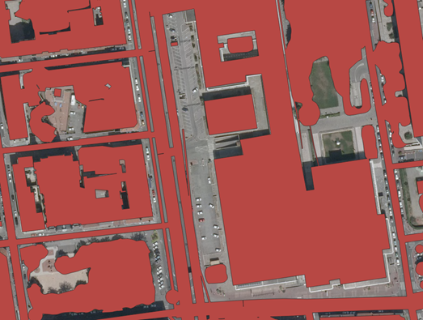
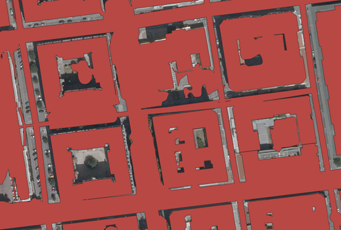
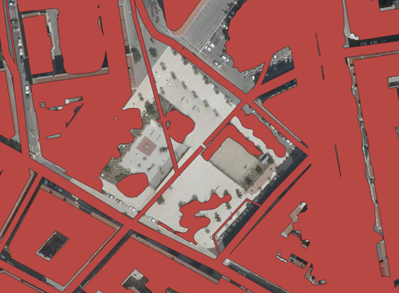
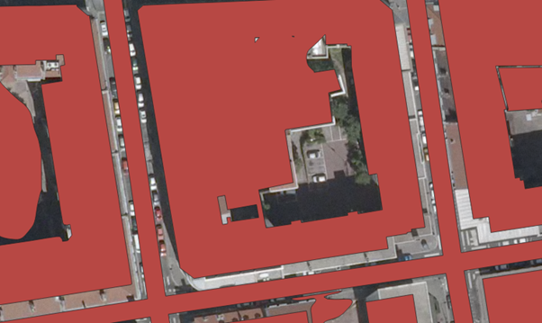
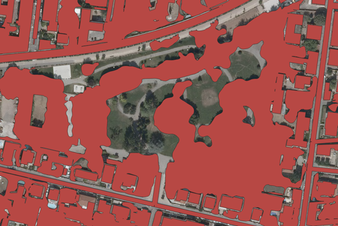
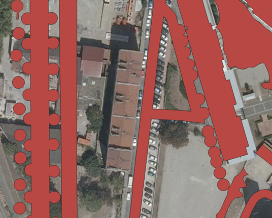
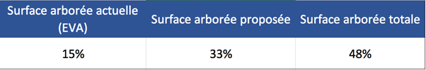
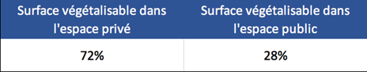
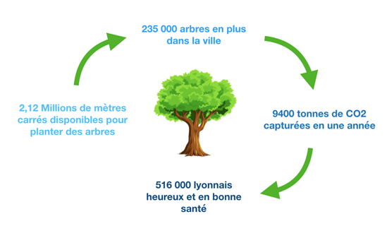

Au début du projet, nous pensions que le résultat, à savoir l’espace disponible à la plantation d’arbres, serait faible, avec très peu d’espaces disponibles. Au final, cette hypothèse s’avère fausse puisque nous disposons d’un masque d’une surface de 2 115 857 m2 disponibles pour végétaliser ! Des zones caractéristiques de l’espace urbain ressortent, **voici nos constats suite aux géotraitements** :

***

* **De nombreux espaces disponibles sur les parkings**

 

Les parkings constituent en majorité les zones potentielles d’exploitation de notre masque. Ce sont des zones utiles dans un espace urbain et nécessaires pour les usagers de la route, néanmoins, de part leurs caractéristiques (larges surfaces planes), il s’agit de zones urbaines permettant la plantation d'arbres en abondance. 

***

* **Les espaces privés fortement représentés**

Au cœur des îlots d’habitations se trouvent généralement de nombreuses zones pouvant être exploitées (cours intérieurs). Toutefois, le pouvoir de changer ces zones ne réside pas dans les mains de la métropole car il s’agit d'espaces privés.

***

* **Les espaces bétonnés : places, squares…**

Ces espaces bétonnés sont majoritairement des places publiques ou des squares. Ce sont des espaces fortement pratiqués par les habitants d’un quartier et importants pour la cohésion sociale. Les supprimer pour végétaliser totalement résulte à supprimer des espaces de vie d’un quartier, néanmoins les aménager avec plus de végétalisation peut être une solution bénéfique pour tous. 

***

* **Les trottoirs et les espaces de stationnement**

Généralement ce sont ces lieux qui sont visés lorsqu’on plante des arbres au sein de l’espace urbain. En superficie, ces espaces représentent une zone limitée, mais ces zones nécessitent moins de travaux d’aménagement, ce qui explique le fait qu’il est plus facile d’exploiter ces zones. Nous aurions souhaité approfondir le traitement de ces types d’espaces (ex : mettre en avant l’importance de laisser passer un flux suffisant de piétons) mais nous ne disposons pas des données nécessaires.  

***

* **Densification des zones déjà végétalisés**

Malgré le fait que certains espaces soient déjà végétalisés, nous avons retenu qu’il est possible d’introniser une végétation plus abondante. Dans l’interprétation, il s’agit d’introduire une strate arborescente sur une strate arbustive ou herbacée. 

Enfin, certains espaces répertoriées se révèlent finalement inexploitables : 

Ces zones, qui font partie du masque, ne sont pas disponibles car de nouveaux bâtis, entrepôts, ou autres constructions ont vu le jour récemment. Cela s'explique par le fait qu’on exploite de nombreuses données, et que parmi ces données certaines se révèlent d’une fiabilité douteuse ([voir les limites](https://github.com/VCityTeam/DatAgora_/wiki/Enjeux_limites_critiques)). 

***

Ensuite, nous avons analysés les résultats de notre masque face à la situation actuelle : 

Avant l’établissement du masque, la canopée renseignée par la couche EVA indiquait qu’en 2015, 15% de la surface du 3ème arrondissement était de la surface arborée. Pour comparer aux chiffres de la commune, Lyon avait une surface arborée d’environ 16% de son territoire total ; le 3ème arrondissement n’était donc pas sous ou sur-arborée par rapport à la moyenne. Toutefois, si l’on compare ces chiffres aux autres grandes métropoles françaises, Lyon fait partie des villes en dessous de la moyenne nationale.

Par exemple : à Toulouse et à Nice, chaque habitant dispose d’environ 42m² de patrimoine arboré par habitant contre seulement 13m² à Lyon. Toutefois il existe des villes comme Paris disposant d’un patrimoine arborée plus faible que Lyon avec 9m²/hab. 

Suite à notre étude, il serait possible d’exploiter une nouvelle surface arborée d’environ 33%, ce qui est colossal. Le 3ème arrondissement de Lyon disposerait donc d’une surface arborée totale d’environ 48%. 

En réalité, il faut prendre du recul sur ces chiffres, tout d’abord par rapport à la fiabilité de notre résultat et des données exploitées mais aussi du fait que d’atteindre ce chiffre nécessiterait des énormes travaux d’aménagements qui changeraient totalement l’espace urbain et donc cela transformerait totalement les pratiques de la ville par les habitants du quartier. De plus, la majeure partie des zones disponibles se trouvent dans l’espace privé. En réalité c’est donc 28 % de la surface totale du masque qui est exploitable pour la Métropole de Lyon :

Pour conclure, notre masque met en avant qu'il est possible d'exploiter une surface assez grande du 3ème arrondissement de Lyon, afin de pouvoir l’arborer. Néanmoins, il est nécessaire de prendre du recul sur les résultats et les chiffres : 

[Page précédente - III.3 - Couche finale](Couche_finale)

[Page suivante - IV.2.i - Enjeux, limites, critiques](Enjeux_limites_critiques)