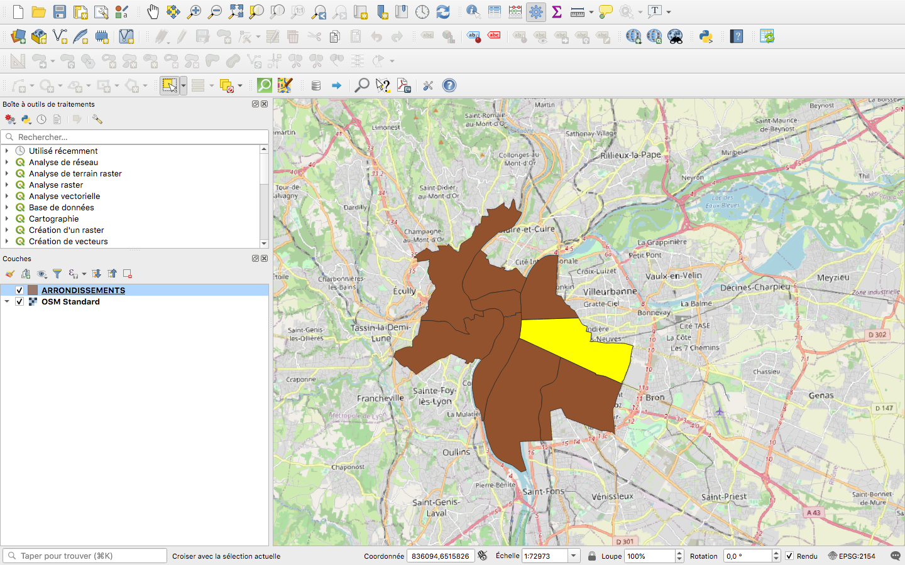
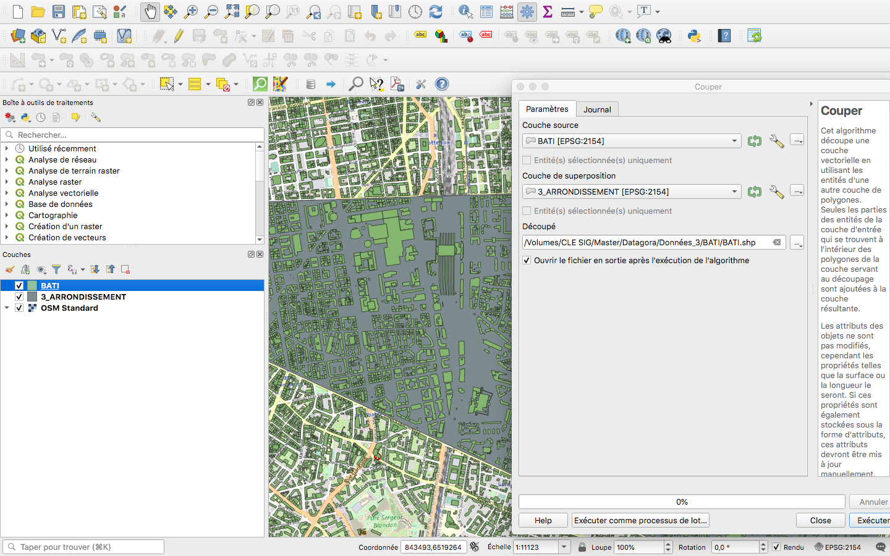
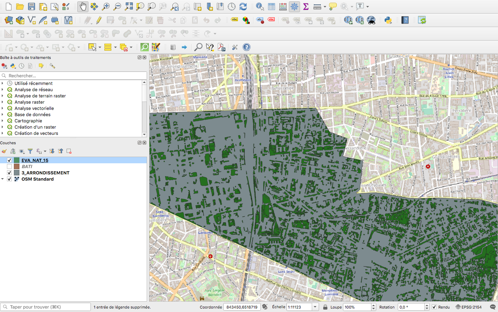
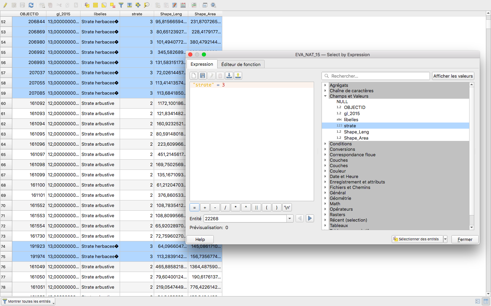
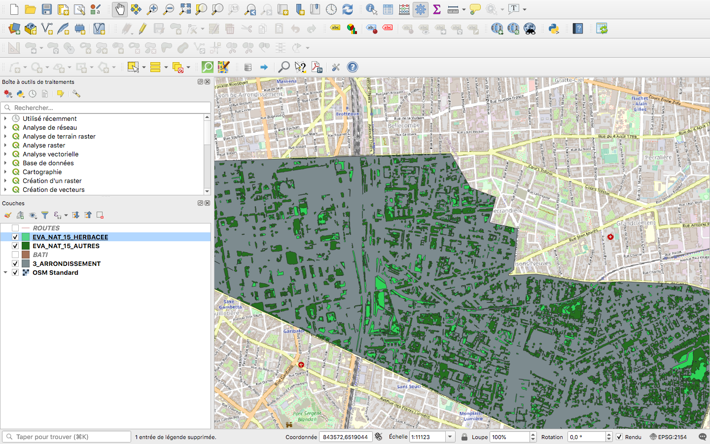

# Ajout des couches et pré-traitements

## 1. Localisation

Sélection par attribut du 3e arrondissement puis export pour créer une couche

## 2. Découpage

Chaque couche est découpée par rapport au 3e arrondissement de Lyon

## 3. Sélection des entités par couche où il est impossible de planter

Couche EVA Naturel

Exclusion des strates herbacées (possibilité de planter des arbres dans ces espaces) :

Séparation en deux couches :

[Page précédente - II.2 - Mise en place d’une méthodologie](Methodologie)

[Page précédente - III.2 - Application de la méthodologie et géo-traitements](https://github.com/VCityTeam/DatAgora/wiki/_Geotraitements)