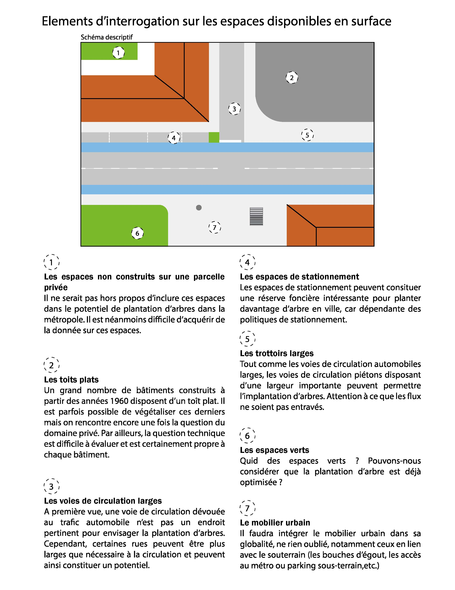
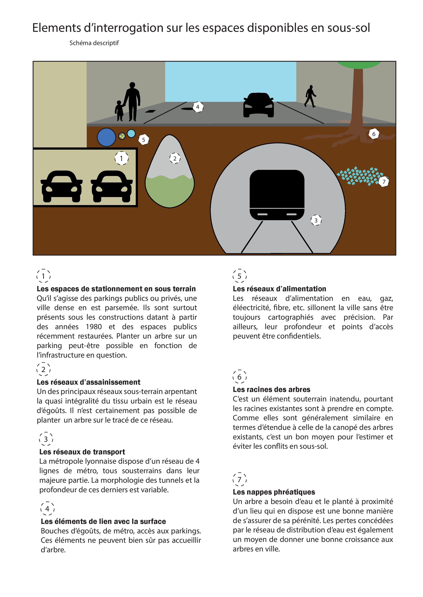

# Pistes de réflexion

Après avoir établi ces différents niveaux de problématiques, nous avons cherché à répondre à ces questions, notamment via une première approche spatiale. 

A la question “Quels sont les éléments qui conditionnent l’implantation d’un arbre en ville ?”, nous avons répondu :

-les éléments de surface
-les éléments souterrains
-les réglementations
-les éléments climatiques 

Dans le cadre de ce travail, les deux premières approches ont été approfondies. La question de la réglementation ne sera pas abordée car ce travail s’inscrit en amont d’une phase réglementaire. En effet, on cherche ici à dégager le potentiel maximal de végétalisation arboré. Par ailleurs, les éléments climatiques nous ont semblé difficile à intégrer dans une méthode. Nous avons pris le parti de ne pas les intégrer à notre résultat, bien que nous aborderons en ouverture une manière de prendre en compte l’exposition au soleil des rues.

Suite à ces premières pistes, nous nous sommes questionnés sur les méthodes de traitement de ces espaces : 

[Page précédente - I.4.ii - Mise en place d’une problématique](https://github.com/VCityTeam/DatAgora/wiki/_Problématique)

[Page suivante - II.1 - Récupération des données](Recuperation_donnees)