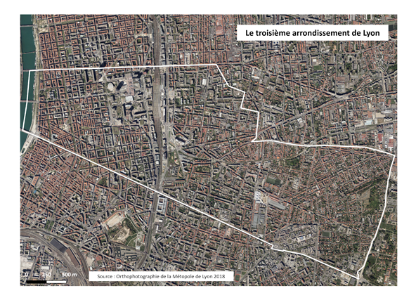
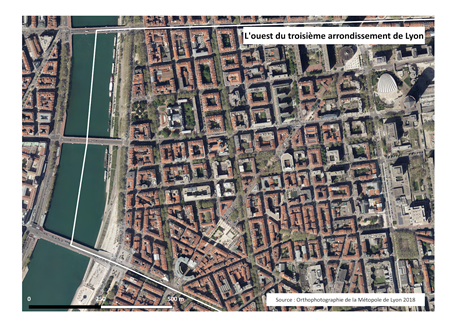
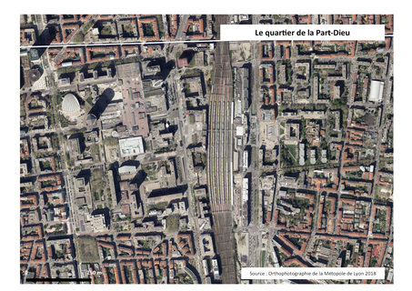
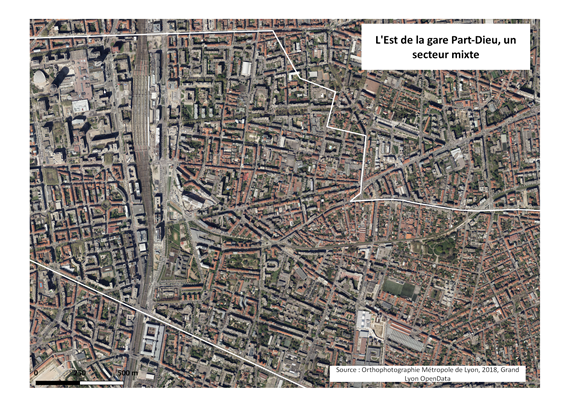
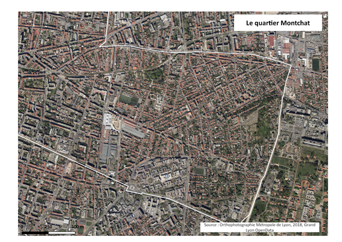

# Territoire d'étude

Bien que la demande initiale de notre étude avait pour objectif de donner des résultats sur le quartier de la Part-Dieu à Lyon, nous avons fait le choix avec les commanditaires de centrer notre travail sur l’ensemble du 3ème arrondissement, à la fois pour des raisons de commodités techniques et des raisons d’analyses de nos résultats. La visualisation 3D devait rester centrée sur le quartier d’affaires. 
Le 3ème arrondissement de Lyon est allongé d’ouest en est, allant du Rhône vers la commune de Bron. Il est atypique car il présente des morphologies urbaines très variées, notamment en matière de type de constructions. La réalisation de notre étude sur ces différentes morphologies urbaines est un bon moyen de vérifier la validité de nos résultats.

La partie ouest, à proximité du Rhône, est à la fois un damier du XVIIIème et XIXème siècle, disposant de voiries de tailles variables, entre grandes avenues et petites rues, et un ancien quartier de faubourg, autour de la Place Gabriel Péri. Les rues y sont plus étroites et le bâti est globalement élevé sur l’ensemble du secteur.  La présence de végétation dans ce secteur se distingue par la présence de nombreux arbres d’alignements, mais aussi au sein de squares, sur les quais du Rhône et plus rarement en cœur d’îlots. 

Plus à l’est se trouve le quartier de la Part-Dieu. Censé devenir le second centre-ville de Lyon dans les années 1960 à 1970, il a été conçu sur le principe de l’urbanisme de dalle. On retrouve ici les grands principes de séparation des flux automobiles et piétons. L’espace public est ainsi très marqué, bien que de nombreux travaux aient lieu depuis plusieurs années pour apaiser le quartier. L'implantation du bâti en retrait de la rue est aussi une caractéristique marquante. Cette morphologie urbaine semble davantage convenir à l’implantation d’arbres. L’urbanisme de dalle permet une plus grande dissémination des espaces arborés et les récents projets urbains du quartier montrent de fortes possibilités de plantation d’arbres sur l’espace public.

  
Le quartier situé à l’est de la gare est un quartier mixte. Ancien quartier ouvrier, il présente des morphologies urbaines proches de celles d’un faubourg, mais également des traces d’emprises militaires, des grands ensembles ou encore des immeubles de bureaux. La présence d’espaces verts est marquée autour du fort Montluc, mais également ponctuellement dans le tissu urbain.

Enfin, l’arrondissement comporte à son extrémité est le quartier de Montchat. Ce secteur, très résidentiel, est marqué par un habitat davantage disséminé et de moindre hauteur. La végétation est présente dans l’espace privé, dans les jardins et cœurs de parcelles. Le tissu urbain dans son ensemble semble plus lâche, même si les voies ne sont pas nécessairement plus larges.

Par l’exemple du 3ème arrondissement, le travail doit être applicable à l’ensemble de la métropole et peut être réalisé sur d’autres territoires disposant des données similaires à celles utilisées. 

[Page précédente - I.3.i - Description du projet](Description_projet)

[Page suivante - I.3.iii - Pourquoi végétaliser dans l’espace urbain ?](Végétaliser_urbain)
