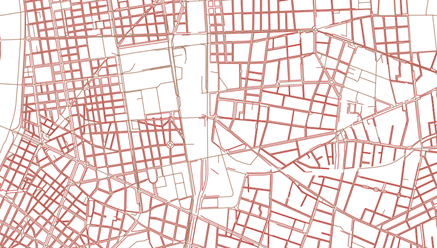
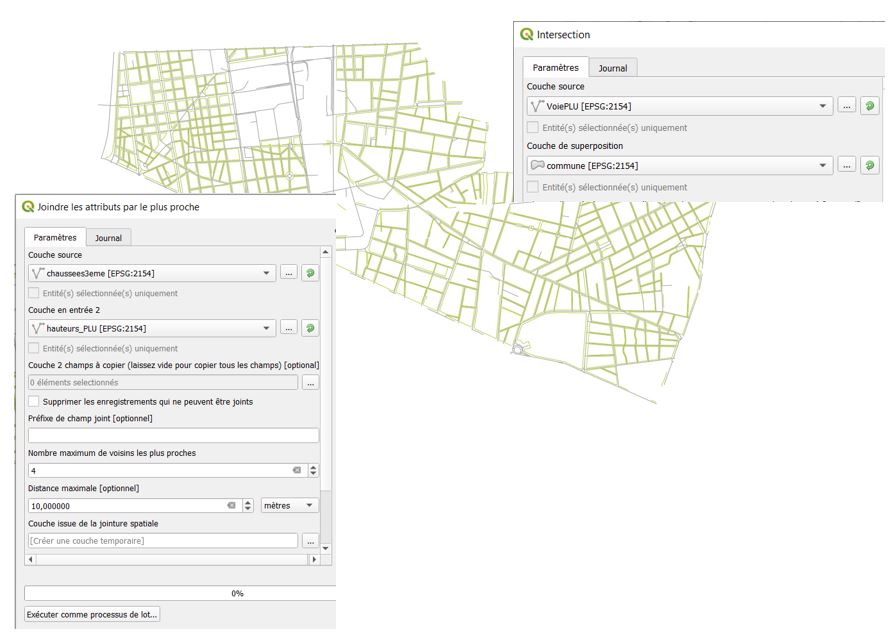
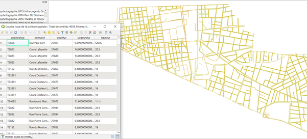
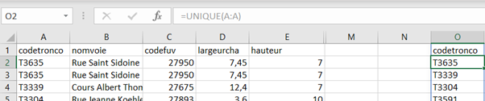
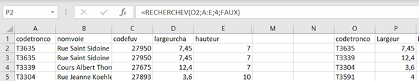
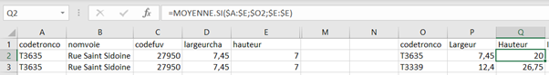
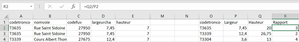
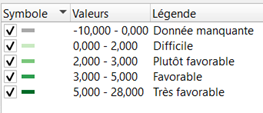
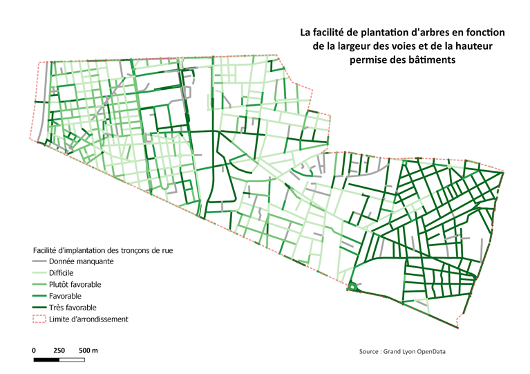

# Inclure la variable Z : la troisième dimension de l’espace public, la hauteur du bâti

L’objectif est ici de donner un indice aux rues en fonction du rapport entre leur largeur et la hauteur maximale des constructions adjacentes. En effet, une rue étroite pourvue de bâtiments élevés est moins à même d’accueillir de nouvelles plantations qu’une rue dégagée et exposée aux rayons du soleil. 

Comme dit précédemment, le 3ème arrondissement de Lyon présente des formes urbaines très variées. La hauteur et l’implantation des bâtiments dans le quartier sont très contrastées. Les données en OpenData du Grand Lyon nous permettent de savoir la largeur de la voie, en prenant en compte la chaussée et les trottoirs. Aussi, une autre couche disponible en Open Data précise la hauteur maximale des bâtiments dans l’alignement des voiries. Cette hauteur est issue du Plan Local d'Urbanisme (PLU) et est très utile car elle permet d’anticiper la hauteur maximale de constructions potentielles à venir. Elle ne reflète cependant pas le territoire à l’instant où la donnée est extraite. Dans cette démarche où le temps long de l’action publique est envisagé, ce type de donnée semble opportun pour notre utilisation. 

## Présentation de la donnée
Importer les deux couches sur QGIS

 

Faire une intersection des deux couches avec celle de la commune pour n’avoir que la zone souhaitée, puis renommer les couches pour qu’elles soient reconnaissables.

## Joindre les couches par attributs le plus proche

Effectuer une jointure d’attributs par le plus proche. Il faut alors définir les deux couches intersectées en entrée, puis un nombre de voisins à prendre en compte. Ici, nous optons pour la valeur 4 car certains tronçons de rues peuvent avoir plusieurs façades de valeurs différentes. Nous sélectionnons la distance maximale de 10 m, pour être certain que les façades soient incluses.

En sortie, nous obtenons une nouvelle couche de jointure. Nous supprimons les champs inutiles et conservons les identifiants de la rue, son nom, sa largeur et la hauteur maximale au PLU.

Puis nous exportons au format CSV la table attributaire.

## Le traitement de la jointure

Nous ouvrons le résultat de la jointure dans un tableur.
Dans un premier temps, en observant la donnée, nous notons quelques corrections à apporter :
* Certaines rues n’ont pas de largeur définie. Celles-ci doivent donc être notées en “donnée manquante”. Pour conserver le format numérique de la cellule, nous optons pour une valeur négative de “-10”. Les résultats négatifs seront donc des “données manquantes”
* Le PLU permet que certaines rues ne comportent pas de limites de hauteur pour leurs bâtiments. Dans ce cas, la valeur est “SANS”. Pour pouvoir malgré tout calculer un indice, nous optons pour coder cette valeur avec le chiffre “50”. Cette valeur nous semble réaliste dans un quartier d’affaires, aux projets de gratte-ciel.

Sur le tableur, avec la formule “UNIQUE”, nous listons les codes de tronçons de rue. 

Avec la formule “RECHERCHEV”, nous allons chercher la largeur du tronçon.

Puis, avec la fonction “MOYENNE.SI”, nous allons chercher la moyenne des hauteurs réglementaires des bâtiments sur les tronçons.

Enfin, nous pouvons calculer le rapport entre la largeur de la rue et sa hauteur réglementaire dans une nouvelle colonne. 

 
 

## La représentation graphique

Suite à cela, nous importons sur QGIS la nouvelle table et nous créons une jointure attributaire, sur le champ des identifiants de tronçons. 

Pour discrétiser les résultats, nous admettons donc que les valeurs négatives sont les données manquantes.  Pour les valeurs inférieures à 2, nous estimons qu’il sera difficile pour un arbre d'avoir suffisamment d’espace et de luminosité pour croître. Entre 2 et 3, la rue présente des dispositions plutôt favorables pour accueillir une arbre, favorable entre 3 et 5 et très favorable au delà. Nous obtenons la carte ci-dessous :

Nous pouvons observer les rues les plus resserrées, où l’horizon est peu dégagé, via cette carte. On distingue les 4 différentes morphologies de quartiers, entre le damier dense, le quartier 1960 - 1970 plus lâche, le faubourg plus resserré et le quartier pavillonnaire plus lâche. Cette carte permet, rapidement, de voir quel secteur peut être le plus favorable, le plus facile, pour planter un arbre. 

 

 

Toutefois, cette approche présente quelques limites. En effet, peu d’études sur ce rapport existent et il a été difficile pour nous de créer une discrétisation pertinente. Aussi, elle ne prend pas en compte l’exposition et la durée d’ensoleillement. Un axe Nord-Sud peut être plus ensoleillé qu’un axe Est-Ouest si l’arbre est positionné au Sud de la voirie et donc caché du soleil par les bâtiments. Cependant, elle offre une perception de la densité intéressante pour l’objectif de notre étude. 

[Page précédente - IV.2.i - Enjeux, limites, critiques](Enjeux_limites_critiques)

[Page suivante - IV.2.iii - Les pistes non explorées](Pistes_non_explorees)
