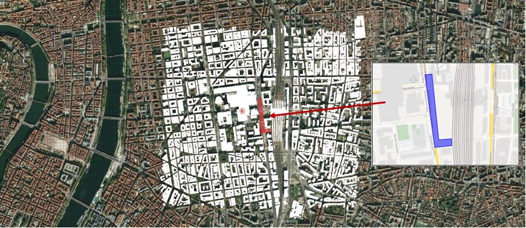
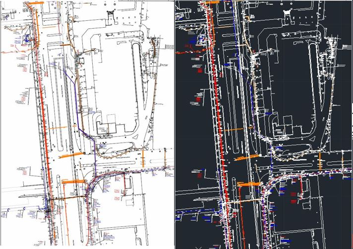
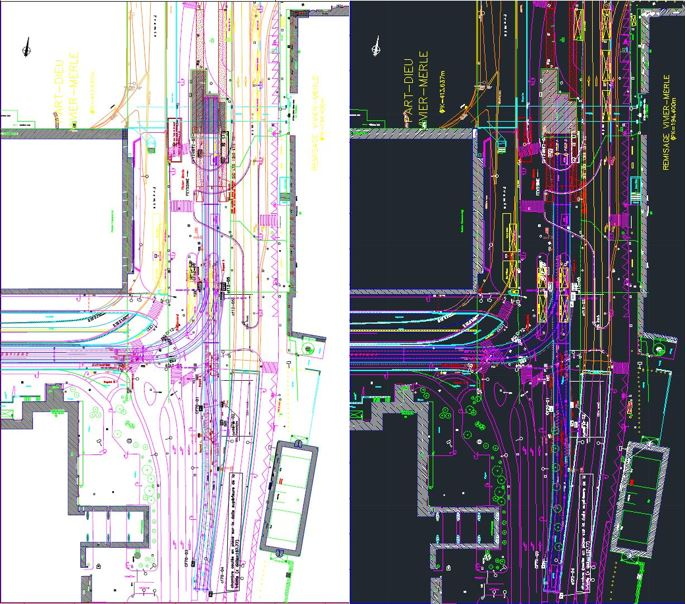
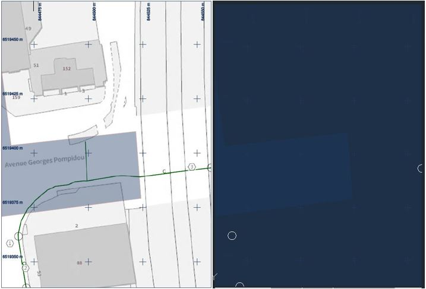

# EVA

# DICT

Une Déclaration d’Intention de Commencement de Travaux (DICT) est un formulaire envoyé par toute personne voulant exécuter des travaux (entreprise de BTP, particuliers,…) aux exploitants de réseaux situés à proximité du chantier qu’il prévoit. La réponse des exploitants, sous forme de plan de réseau (fichier PDF), permet à l'exécutant de connaître précisément la localisation des réseaux et d’obtenir des recommandations particulières de sécurité relatives à la présence de ces ouvrages, afin d'éviter leur endommagement.

Dans le cadre de notre projet, il nous a semblé utile de faire une DICT sur une petite zone du quartier Part-Dieu, une zone test, afin de voir comment il était possible d'intégrer ces données qui portent sur l'ensemble des réseaux souterrains.
Les données que nous ont renvoyées les exploitants sont au format PDF. Il est possible avec le logiciel AutoCAD de vectoriser ces PDF afin de récupérer les lignes des réseaux, et leur emplacement par rapport au plan de la rue dans laquelle ils se trouvent. 

Dans un premier temps, nous avons importé notre shape du bâti dans AutoCAD, que nous avons géolocalisé sur un fond de carte en vue satellitaire.
Ci-dessous, vous pouvez voir à droite la zone d'implantation des plans issus de la DICT.

Ensuite, nous avons importé les PDF des réseaux des exploitants sur AutoCAD, en vecteur, afin de pouvoir y récupérer les lignes des réseaux.
A titre d'exemple, vous retrouvez ci-dessous la documentation d'ENEDIS. A gauche, l'image issue du PDF, à droite l'image vectorisée sur AutoCAD :

Ici, la documentation de TCL. A gauche, l'image issue du PDF, à droite l'image vectorisée sur AutoCAD :

La multitude d'information sur ce plan de réseau est difficilement gérable. 

De plus, une grande partie des plans de réseaux qui nous ont été transmis ne sont pas vectorisables. De ce fait, nous ne pouvons récupérer les lignes des réseaux, à moins de décalquer celle-ci sur l'image raster, ce qui implique beaucoup de temps et une imprécision.
A titre d'exemple, vous retrouvez ci-dessous la documentation de SFR. A gauche, l'image issue du PDF, à droite l'image vectorisée sur AutoCAD :

Enfin, les plans des réseaux de chaque exploitants sont fournis à des échelles différentes, ce qui implique une remise à l'échelle systématique de ces réseaux pour qu'ils "collent" à notre shape du bâti.

Après plusieurs essais infructueux et chronophages, nous décidons d'abonder l'idée d'exploiter les plans DICT puisqu'ils ne sont pas adaptés à un projet à l'échelle d'un quartier. 

[Page précédente - II.1.i - Les données disponibles en Open Source](Donnees_opensource)

[Page suivante - II.1.iii - Tableau des données](tableau_donnees)