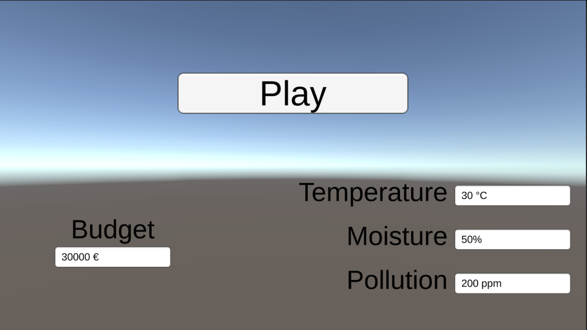

### Menu principal
Le menu principal est une scène à part dans laquelle il est possible de régler les valeurs de départ des flux et du budget. Par défaut, le budget est réglé sur _Illimité_. Le bouton _Play_ permet de lancer la simulation.

[Page précédente - II.6 - Écoulement du temps](Temps)

[Page suivante - III - Modèles](Modeles)