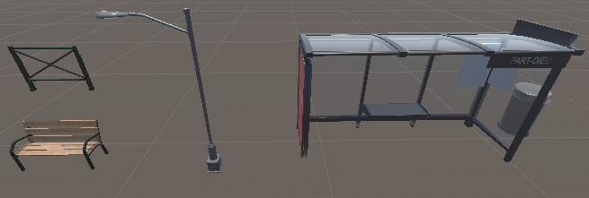
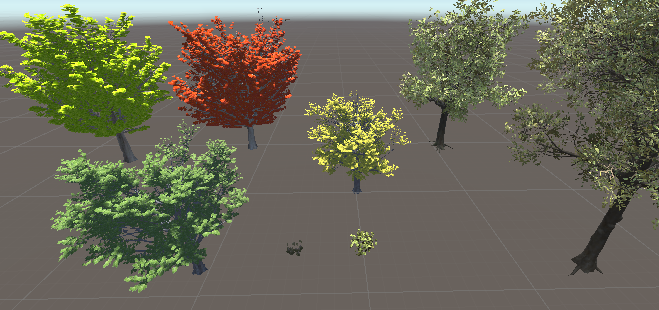

## Modèles

### Mobilier urbain
Du mobilier urbain aux modèles directement inspirés du mobilier urbain lyonnais sont disposés dans la scène.

### Plantes
La plupart des plantes (arbres, fleurs et buissons) ont été créé à l'aide de l'outil SpeedTree. Les autres modèles proviennent de l'Unity Asset Store.

Plantes avec SpeedTree:

[Page précédente - II.7 - Menu principal](Menu)

[Page suivante - IV.1 - Managers](Managers)

