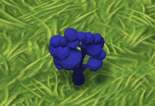
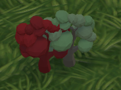

###  Plantes et placement

Des plantes peuvent être placées dans la scène sur les espaces autorisés. Ces plantes sont réparties sur trois strates:
1. La strate arborée, par exemple platanes, érables, chênes etc.
2. La strate arbuste, par exemple houx, rosiers, lauriers etc.
3. La strate herbacée, par exemple gazon, fleurs etc.

La plante souhaitée peut être sélectionnée dans l'interface utilisateur (UI) du joueur en cliquant sur le bouton correspondant. La plante pourra ensuite être déplacée dans la scène, elle suivra le curseur du joueur. Pendant le déplacement de la plante, il est possible de savoir si l'emplacement est valide grâce à la couleur de la plante: rouge si invalide, bleu si valide.
Si le joueur clic-gauche sur une zone valide, la plante sera placée à l'endroit sélectionné et reprendra sa couleur originelle. Si l'emplacement n'est pas valide, la plante continuera de suivre le curseur du joueur et ne sera pas placée.
Si le joueur clic-droit pendant le déplacement de la plante ou s'il clique sur un bouton de l'UI pour sélectionner une autre plante, la plante actuelle sera détruite. Il est aussi possible de clic-droit sur une plante déjà placée pour la détruire.

Les plantes ne peuvent être placées que sur les emplacements prévus à cet effet. De plus, certaines plantes ne peuvent pas être posées sur un emplacement si celui-ci est déjà occupé par d'autres plantes. Par exemple, il faut laisser un espace entre deux arbres pour les placer sur un même emplacement, il sera néanmoins possible de placer une fleur au pied d'un arbre déjà présent. Les emplacements valides possèdent pour la plupart une texture de terre.

Lors du placement, la plante prend une couleur bleue quand l'emplacement est valide. Inversement, la plante devient rouge si la position est invalide. Une fois la plante placée sur un bon emplacement, elle reprend sa couleur initiale.

[Page précédente - II.2 - Personnages non joueur, véhicules et chemins](PNJ_Vehicules_Chemins)

[Page suivante - II.4 - Grille et flux](Grille)