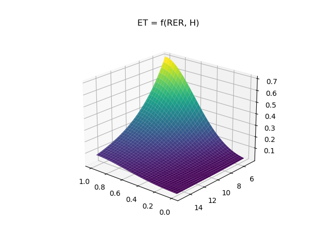
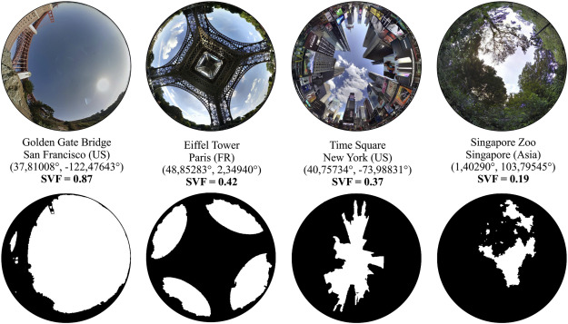
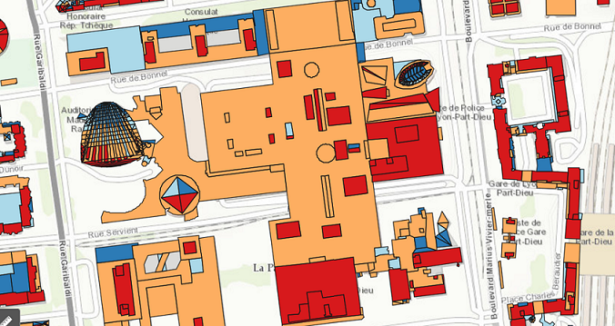

## Introduction
Afin de pouvoir prendre en compte différents types de végétalisation de la ville possibles, nous avons travaillé sur la possibilité d'installer des toits végétalisés dans la zone étudiée. Pour cela, nous nous sommes appuyés sur le travail de mémoire de Barbara Tolino dont un résumé se trouve plus loin dans ce wiki. Ainsi, notre objectif était d'implanter ce même calculs de 4 indicateurs mais totalement avec des GeoDataFrame en Python, sans utiliser QGIS. Ces indicateurs ont pour but l'aide à la décision, il ne s'agit pas de déterminer quel toit peut être végétalisé dans l'absolu mais plutôt de comparer les toîts sur la zone étudiée afin de déterminer quels sont les toîts à végétaliser en priorité. Chronologiquement, ce travail s'est déroulé en 3 phases : 

1. Recherches sur le sujet des toits végétalisés 
2. Etude du [mémoire de Barbara Tolino](Memoire-de-Barbara-TOLINO) 
3. Implémentation de ses 4 indicateurs en Python
4. Création d'un indicateur global permettant de regrouper les 4 indicateurs précédents

## Sources
Pour réaliser cette implémentation, nous nous sommes appuyés sur le module `t4gpd`, un module dont l'objectif est de faciliter l'analyse spatiale en python, en complément de `GeoPandas`. Nous avons aussi utilisé les modules `Geopy` et `pysolar`. Le premier est utilisé afin de calculer des distances entre deux points situés à la surface de la terre et le deuxième afin de simuler les rayons du soleil qui atteignent un certain point sur Terre. 

Les fonctions de T4GPD utilisées sont développées par Thomas Leduc, et disponibles ici: https://github.com/crenau/t4gpd
Nous le remercions chaleureusement pour son travail, son cours et ses conseils.

## Critères choisis

Ces indicateurs sont les suivants : 
- **Efficacité thermique**
- **Réduction de l'îlot de chaleur**
- **Surface verte visible** depuis les bâtiments alentours 
- **Ensoleillement du toît**, indispensable pour faire pousser les plantes. 

Nous avons choisi de ne pas créer de nouveaux indicateurs, le travail d'adaptation et d'implantation de ceux-ci étant déjà conséquent. De plus, nous avons pensé ces indicateurs tour à fait adaptés à notre projet. En effet, le plan Canopée a pour but de rendre l'espace public plus agréable et respirable, notamment en été. C'est pourquoi l'indicateur de réduction de l'îlot de chaleur est particulièrement pertinent. 

## Traitements préalables 
On utilise la zone entière de notre projet, à savoir un buffer d'1km autour de l'Iris correspondant à la gare de Part-Dieu. Grâce à un fichier shapefile présent sur l'opendata du Grand Lyon, nous avons pu récupérer les toits plats sur cette zone. 

Par ailleurs, la législation - pour des raisons liées aux risques incendie - interdit de placer la structure permettant de végétaliser le toit trop proche du bord de ce toit. On applique donc un `buffer` qui permet de réduire les zones de 50cm sur les bords.
 
Ensuite, il est généralement recommandé d'installer un toit végétalisé sur des toits de surface suffisamment conséquente, c'est pourquoi on filtre les élements pour ne garder que ceux de plus de 50m2. 

## Etude en Python

### Efficacité thermique
Un premier indicateur qui permet de quantifier l'interet d'un toit végétalisé est l'efficacite thermique (**ET**). Cette efficacité est définie dans le mémoire de Barbara Tolino par l'économie d'énergie relative réalisée pour un bâtiment avec un toit végétalisé par rapport au même bâtiment sans toit végétal afin de présenter une même température de l'air dans le bâtiment. 

Cette efficacité thermique est liée au **RER** (Roof to Envelope Ratio) du bâtiment à savoir le rapport entre la surface du toit et la surface de son enveloppe (somme des surfaces de son toit et de ses façades laterales). 
On calcule donc ce **RER** en approximant que la surface des façades laterales est égale au périmètre multiplié par la hauteur totale du bâtiment. Cette aproximation ne permet pas de prendre compte des asymétries du bâtiment mais comme nous travaillons uniquement sur des toits plats nous pouvons supposer de manière raisonnable que ces bâtiments sont pour la majorité parallépidiques ou s'en rapprochent. 

Ensuite, nous réutilisons la formule d'efficacité thermique ainsi que la valeur des coefficients de cette équation présentée par Barbara Tolino dans son mémoire, elle-même s'appuyant sur les travaux de *Martens et al. (2008)*. Nous pouvons voir ci-dessous une modélisation effectuée par Thomas Leduc du lien entre le **RER**, la hauteur **H** du bâtiment et l'efficacité thermique **ET**. Cela explique la présence du **RER** et de la hauteur dans l'expression que nous utilisons dans le code. 

Nous avons alors créé **ET**, notre coefficient d'efficacité thermique. Plus il est élevé, plus l'installation d'un toit végétalisé permettrait de réduire les besoins énergétiques du bâtiment. 

### Réduction de l'îlot de chaleur

Comme on l'apprend dans le mémoire de Barbara Tolino, la réduction de l'îlot de chaleur (réduction de la température de l'air, en °C) est fortement liée à la densité de toits végétalisés entourant le toît que l'on étudie. Pour cela, on cherche donc à déterminer la surface de toits végétalisés contenue dans un certain rayon autour du toit étudié comparée à la surface de toits totale, ici on choisit un rayon de 200m. Puisque nous sommes dans une démarche d'évaluation d'une possibilité de végétalisation, on considère que tous les toits plats alentours sont végétalisés, afin de quantifier l'impact maximal que le toit pourrait avoir dans de bonnes conditions. 

On calcule alors le **GRCF** ou *Green Roof Coverage Fraction* pour chaque toît plat. Il s'agit là du rapport entre la surface des toits plats contenus dans un rayon de 200m autour de ce toit de référence et la surface totale des toits contenus dans ce même rayon. 

Ainsi, on crée deux listes (une pour les toits plats et une autre pour tous les toits) en créant une variable S pour chaque toit à laquelle on ajoute les surfaces des toits dont le centroide est contenu dans le rayon de 200m. On calcule ces surfaces avec une double boucle `for` ce qui justifie des calculs assez longs pour cette étape et on supprime les géométries vides afin d'éviter des erreurs dans la suite. Ces deux listes deviennent ensuite deux colonnes du GeoDataFrame afin de pouvoir calculer le GRCF donc le rapport (pour chaque toit) entre les deux surfaces. 

Ensuite, comme l'explique Barbara Tolino, pour un GRCF de 0.9, la diminution de l'îlot de chaleur est de 0,5°C. On a donc : 

_RICU=0.5*GRCF/0.9_

### Surface Verte Visible 

L'indice de surface verte visible permet de savoir à quel point le toit - si il était végétalisé et donc vert - serait visible depuis d'autres bâtiments ou depuis l'espace public, ce qui permet de rendre la ville plus agréable par des facteurs psychologiques. 

Pour cela, nous utilisons la fonction `SkyViewFactorOnTopOfRoof` implantée par Thomas Leduc dans le module `t4gpd`. Cette fonction permet, comme son nom l'indique de calculer un facteur de vue du ciel (**SVF**) depuis un toît. Plus exactement, il s'agit du rapport entre la surface de ciel visible (non obstruée par des bâtiments ou autre) depuis le toit et une demi sphere centrée sur ce toit. 

_Image d'illustration du SVF pour plusieurs dispositions différentes_

Ce qui nous intéresse est donc l'opposé de ce que le toît "voit", à savoir la surface de bâtiments qui "voit" le toit. On utilise donc comme indicateur de surface verte visible **SVV** : 

_SVV = 1 - SVF_

Ici on utilise comme paramètres de la fonction `SkyViewFactorOnTopOfRoof` un nombre de rayons égal à 16 et une longueur maximale de rayons de 100m. Cela indique juste que pour calculer cette surface non obstruée on vérifie (de manière simplifiée) sur 16 rayons qui partent du toit combien ne rencontrent pas d'obstacles au bout de 100m. Ce nombre pourrait être augmenté, nous l'avons juste placé à 16 pour des raisons de rapidité de calcul. On utilise ensuite la fonction `STGeoProcess` qui permet juste d'appliquer le process précédent à notre dataframe pour créer un autre dataframe. 

On réalise immédiatement une reprojection de ce nouveau dataframe en WGS 84 car nous avons rencontré de gros problèmes dans notre visualisation si nous ne respections pas cette étape dès la création du dataframe. 

### Ensoleillement

L'exposition au soleil du toît est un facteur primordial à prendre en compte pour végétaliser un toit. En effet, sans ensoleillement correct, les plantes sont incapables de pousser et ne peuvent apporter aucun des avantages modélisés par les indicateurs précédents. C'est pourquoi nous avons repris l'indicateur proposé par Barbara Tolino. Comme on peut le voir sur l'image suivante, l'ensoleillement peut beaucoup varier d'un toit à l'autre, même si ils sont voisins. 

_Image tirée du cadastre solaire de la ville de Lyon pour une partie de notre zone_

On commence par créer une liste de tous les instants auxquels on veut étudier l'ensoleillement de nos toits. On choisit une journée par mois pendant l'année, le 21 afin de pouvoir évaluer l'ensoleillement à son maximum et à son minimum. On choisit aussi de ne prendre en compte que certaines heures de la journée à savoir de 9h à 18h, à chaque fois l'instant sera considéré à l'heure pile. Ce sont des approximations qui pourraient être évidemment discutées mais nous avons pensé que l'ensoleillement une fois par heure de 9h à 18h considérait un bon échantillon pour déterminer si le toît était souvent exposé au soleil ou non, prendre des mesures plus tôt le matin et plus tard le soir n'étant que peu pertinent puisque ce ne sont pas là les heures les plus ensoleillées de toute manière. 

On utilise donc ensuite la fonction `SunshineDurationOnTopOfRoof`, elle aussi implémentée par Thomas Leduc dans `t4gpd`. Elle permet de déterminer si le toit est exposé au soleil durant les instants considérés ou non. On utilise ensuite de nouveau la fonction `STGeoProcess`. Elle ajoute deux colonnes dans le dataframe : `sun hits` qui est le nombre d'instants où le toit est au soleil et `sun ratio` reprend ce chiffre divisé par le nombre total d'instants à savoir ici 120. Notre indicateur d'ensoleillement est donc ce **SUN_RATIO**. 

### Indicateur final
On commence par normaliser tous les indicateurs pour que leurs valeurs soient comprises entre 0 et 1. Contrairement à Barbara Tolino, nous avons choisi de normaliser les valeurs des indicateurs par rapport du maximum de l'indicateur sur la zone. Cela ne permet pas d'avoir une mesure objective de la capacité du toit végétalisé à réduire l'îlot de chaleur par exemple mais cela nous apporte une bonne base pour comparer les toits entre eux, comme c'est l'objectif. 

On crée un indicateur global de végétalisation noté **IGVG** basé sur les quatre précédents indicateurs qui permet de comparer la potentialité de végétalisation des toits plats. Cet indicateur n'est qu'une proposition, proposition qui diffère d'ailleurs de la méthode utilisée par Barbara Tolino. En effet, la pondération des précédents indicateurs est ici adaptée au plan Canopée et à ses objectifs. On a donc l'expression ci-dessous (où A, B et C sont des coefficients qui seront explicités plus tard) : 

_IGVG = SUNRATIO_n(A\*SVV_n + B\*RICU_n + C*ET_n)_  

On comprend facilement que l'ensoleillement est le critère le plus contraignant pour la végétalisation d'un toit. En effet, les professionnels du métier considèrent qu'en dessous d'une heure de soleil direct par jour (et donc d'un SUNRATIO_n inférieur à 0,1) on ne peut absolument pas végétaliser un toit de manière viable. Entre 1h et 3h de soleil par jour, on considère que le végétalisation est faisable mais absolument pas idéale. 

C'est pourquoi nous avons décidé d'indiquer comme "non-végétalisable" dans notre les toits dont le SUNRATIO_n est inférieur à 0,1. On a donc IGVG = 0 dans ce cas. On considère aussi SUNRATIO_n comme étant un facteur prépondérant dans le calcul de l'IGVG, c'est pourquoi il est en facteur des autres indicateurs. 

Dans le cadre du plan Canopée, on accorde tout d'abord une importance plus grande à la réduction de l'îlot de chaleur urbain, ensuite à la surface verte visible (qui contribue au confort des habitants puisque psychologiquement le vert est considéré comme "agréable" à regarder) et enfin une importance moins grande à l'efficacité thermique du bâtiment puisque le plan a plutôt pour cadre l'espace public. 

C'est pourquoi on attribue les valeurs suivantes aux coefficients : 

- A = 0,35
- B = 0,50 
- C = 0,15

On obtient alors un résultat dont nous discuterons dans la partie dédiée de ce wiki. 

## Discussion à propos de la méthode 

Une des pistes d'amélioration de cette méthode est l'ajustement des coefficients permettant d'obtenir l'indicateur total. Notre objectif de base était plus de créer une carte pour chaque indicateur qui se compléteraient pour l'aide à la décision, pas forcément un indicateur global. Cependant, afin de pouvoir incorporer ce travail avec celui des autres et présenter toutes les données sur la même carte, il fallait pouvoir créer cet indicateur global. Ainsi ces coefficients ont été choisis de manière empirique, il serait donc possible de définir une méthode afin d'en améliorer le choix. 

De plus, les données de l'opendata de Lyon sur les toits plats ne sont peut-être pas forcément représentatives de la réalité actuelle puisqu'elles datent de 2015. Par exemple, un des toits près de la gare est contenu dans ces données alors qu'il semble avoir été détruit depuis (cf Google Street View, où l'on peut voir les travaux de démolition). Ainsi, certaines surfaces considérés comme toits plats ne sont pas forcément contenus dans la donnée des bâtiments utilisée dans le reste du projet. 

Pour ce qui est du code, la structure de certaines fonctions me forçait à créer de nouveaux dataframes, ce qui peut poser un problème de confusion à la lecture du script. 

Par ailleurs, le code est relativement long à tourner (plusieurs heures pour la zone complète). Il faut donc prendre cela en compte lors de son utilisation.

[Page précédente - Données d'ombre](Donnees-d-ombre)

[Page suivante - Vision arborée](biophi)
