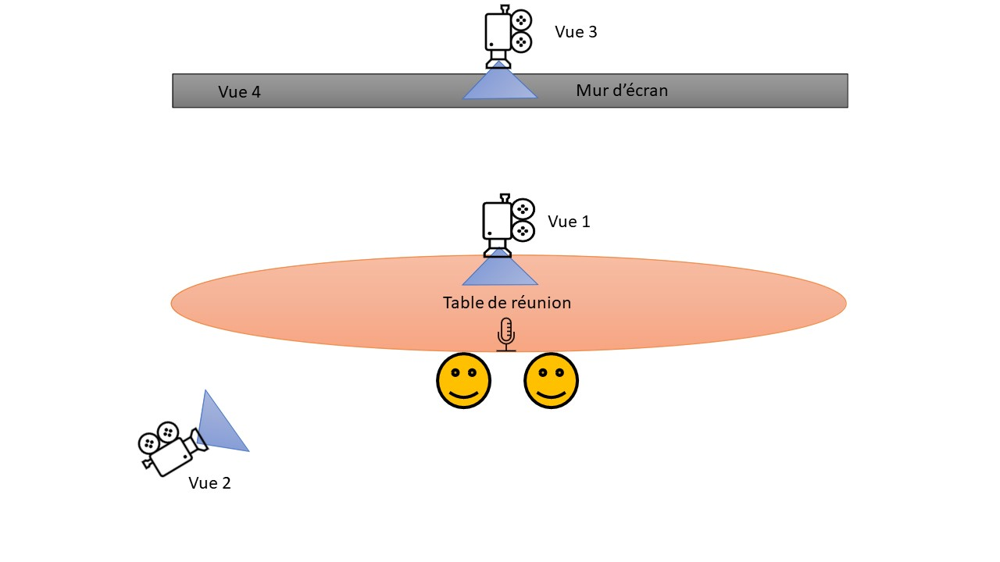
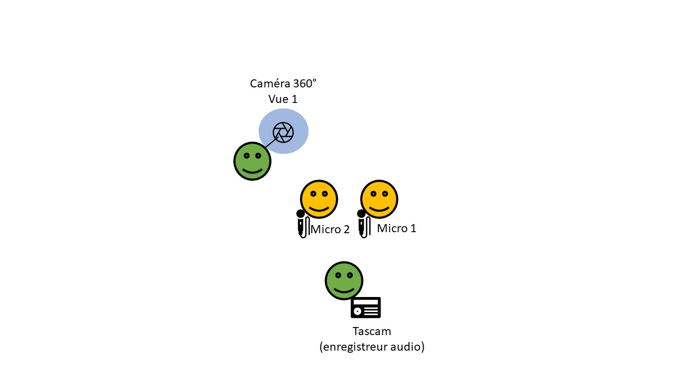

|||||
|---|---|---|---|

# GUIDE
June-December 2021

> *Au croisement des disciplines que sont l’informatique graphique et l’analyse des interactions, le projet GUIDE se questionne sur **les similitudes et différences existantes dans l’appropriation d’un lieu selon qu’il s’agisse d’un lieu dans l’univers tangible ou dans un univers numérique**.*

## Conception d’une maquette numérique du campus de Bron comme environnement d’expérimentation
Une maquette numérique du campus de Bron est conçue afin de servir d’environnement numérique pour l’expérimentation sur l’orientation.
### Données existantes
Concernant les outils et données disponibles pour réaliser une reproduction numérique du campus de Porte des Alpes, une maquette numérique géoréférencée existe déjà dans les données ouvertes de la métropole de Lyon.

Visualisation en vue aérienne de la maquette numérique disponible dans les données ouvertes.

Visualisation en vue à la troisième personne de la maquette numérique disponible dans les données ouvertes.

### Maquette détaillée par infographie
La maquette des données ouvertes de la métropole est cependant trop grossière pour une exploration numérique à échelle humaine. L’idée est donc de partir de ce modèle et de l’enrichir avec plus de détails géométriques et d’aspect (couleurs).
Pour ce faire, la prestation extérieure d’un artiste infographiste est requise. Cette prestation a débuté le 19 novembre, et se terminera à la fin du mois de novembre.

Visualisation (dans Blender) de l’état de la maquette numérique détaillée manuellement au 17 novembre.

#### Références photographiques
Plusieurs centaines de photos du campus, ainsi que des plans d’évacuation du campus ont été prises sur place pour servir de référence durant la réalisation infographique.
#### Recherche de plans ou autres maquettes
La DIMMO a aussi été consultée par l’intermédiaire de Julien Prudent (premier contact tardif le 16 novembre) dans le but d’obtenir des plans d’architecte ou des maquettes numériques plus détaillées. Aucun élément ne nous a pour le moment été communiqué.

### Exploration interactive de la maquette
La maquette est chargée dans l’application web de visualisation 3D de données géospatiales UD-Viz. Cette application qui est développée au LIRIS par l’équipe-projet VCity se base sur le framework iTowns et permet de visualiser et d’explorer des données urbaines telles que des cartes mais aussi des modèles géométriques 3D ou sous forme de nuages de points.
Les données urbaines ouvertes de la métropole de Lyon ont déjà été exploitées à plusieurs reprises dans le cadre de différentes réalisations de VCity en proposant des navigations/visualisations aériennes. L’exploration/la navigation à la première personne qui est commune dans les jeux-vidéo est cependant une fonctionnalité nouvelle d’UD-Viz développée durant le projet GUIDE.

## Expérimentation Porte des Alpes
L’objectif du projet GUIDE est de récolter et d’analyser des interactions sur les pratiques d’orientation sur le Campus Porte des Alpes, que ce soit dans l’univers tangible ou à travers l’utilisation de la maquette 3D. 
### Cas d’application : Campus Porte des Alpes - Bron
Nous prendrons ici l’exemple de déplacements sur un campus universitaire (le campus Porte des Alpes (désormais PdA) de l’Université Lumière Lyon 2 située à Bron).
Le campus PdA  est l’un des deux campus principaux de l’Université Lumière Lyon 2. Excentré du centre-ville de Lyon, il se situe sur la commune de Bron et s’étale sur une superficie de 70 444m2. Il accueille chaque année plus de 16 000 étudiants (soit plus de la moitié des étudiants de l’université). 

### Protocole
#### Tâche à accomplir : 
Une tâche particulière d’orientation sur le campus sera demandée aux participants. 
Il s’agira d’un parcours à réaliser sur le campus (IRL ou virtuelle). L’idée retenue est de soumettre aux participants un emploi du temps factice et de leur demander de se rendre, dans l’ordre indiqué, aux différents bâtiments et points stratégiques. 
Dans l’idéal, la tâche ne devra pas dépasser les 20 minutes. 
L’emploi du temps se trouve en Annexe 1
#### Participants
Les participants seront sélectionnés parmi les candidats volontaires, suite à un appel. Nous essayerons autant que possible :
- de respecter une parité de genre 
- de faire participer des candidats ayant entre 18 et 25 ans (tranche d’âge « étudiante »)
- de sélectionner les candidats de langue maternelle française (pour éviter que de potentiels problèmes liés à l’usage de la langue n’entrent en jeu)

Les candidats passeront les tests en binômes, répartis en fonction de leur connaissance ou non du campus. C’est-à-dire qu’il y aura des candidats dits néophytes n’ayant jamais été sur le campus Porte des Alpes et des candidats experts connaissant, eux, le campus. 
- Binôme 1 : 2 experts
- Binôme 2 et 2bis : 2 néophytes
- Binôme 3 : 1 expert et 1 néophyte (mixte)
#### Expérimentation
|Monde|Date|Binôme| Intérêt supposé|
|---|---|---|---|
|Virtuel|06/12/2021|Binôme 1  (experts)|Verbalisation des choix, et confrontation entre les habitudes de circulation des deux participants.|
|Virtuel|06/12/2021|Binôme 2  (néophytes)|Verbalisation de la recherche d’indices à l’orientation et la prise de décision|
|Virtuel|06/12/2021|Binôme 3  (mixte)|Échanges de type « indication d’itinéraires » |
|Réel|03/12/2021|Binôme 2bis  (néophytes)|Verbalisation de la recherche d’indices à l’orientation et la prise de décision|

Des autorisations d'enregistrement seront distribuées et expliquées aux participants et signées avant chaque enregistrement.

##### Phase 1 : Expérimentation Monde Virtuel
Dans le cadre de l’expérimentation via la maquette 3D numérique, la séance se déroule dans les locaux du laboratoire ICAR, à l’ENS, dans la salle d’écran DatAgora. 
La simulation sera lancée sur le mur d’écran afin de permettre une plus grande immersion de permettre une collecte de données en présentiel facilitée. 
L’emploi du temps sera donné en version papier 
###### Dispositif d’enregistrement 
Le dispositif d’enregistrement utilisé sera le suivant : 
- Deux caméra trépied :
  - face participants  + micro caméra (vue 1)
  - dos participants + visualisation écran + micro caméra (vue 2)
- Une prise de vue vidéo à partir de la caméra fixe de la barre de son + micro table  (vue 3)
- Capture d’écran continue + micro intégré à l’ordinateur  (vue 4)
- Enregistrement des traces numériques

Dispositif d'enregistrement fixe

Des masques de protection transparents réutilisables seront achetés afin de minimiser l’impact des masques (et l’absence de visualisation de la partie inférieure du visage) sur le corpus et a fortiori sur les analyses linguistiques. Ils seront aussi utilisés dans la phase 2 de l’expérimentation.  

##### Phase 2 : Expérimentation IRL
Afin de pouvoir apporter une complémentarité aux enregistrements réalisés sur le mur d’écran, il sera mené une expérimentation similaire en situation réelle sur le campus Porte des Alpes de Bron. 
Le même emploi du temps leur sera remis et ils devront, à la manière de la phase 1 de l’expérimentation, se déplacer à travers le campus et relier les différents points mentionnés. 

Afin de limiter la présence d’autres étudiants, il est proposé que cette phase d’expérimentation se déroule un samedi (à confirmer si le campus est bien ouvert les samedis).

Le binôme qui réalisera cette tâche sera un binôme 2bis (2 nouveaux participants néophytes) afin de comparer les comportements de « premier pas sur le campus » entre une expérience tangible et numérique. 
##### Dispositif d’enregistrement mobile
Le dispositif mobile mis en place est constitué 
- d’une caméra 360 tenue par l’un des expérimentateurs
- de deux micros-cravate positionnés sur les participants
- d’un récepteur-enregistreur audio (Tascam) récoltant les entrées son des micros des participants. 

Une trace GPS du parcours des participants sera aussi réalisée.

Dispositif d'enregistrement mobile

### Traitement des données
#### Constitution du corpus
##### Extraction
Les données ont été extraites et synchronisées au laboratoire ICAR. Des montages multi-vues synchronisés ont été réalisés, ainsi qu’une découpe des extraits d’expérimentation. 
##### Transcriptions 
Après visualisation du corpus, les passages pertinents sélectionnés seront transcrits. Si les délais le permettent, l’intégralité du corpus sera transcrit. 
La transcription sera faite selon les conventions de transcription [ICOR](http://icar.cnrs.fr/projets/corinte/documents/2013_Conv_ICOR_250313.pdf) et prendra en compte les aspects multimodaux suivants :
- Regards entre participants
- Gestes des participants
- Interactions avec l’ordinateur 

A ce jour, le format de la transcription n’est pas déterminé (transcription texte sous word, ou alignement vidéo sous ELAN).
##### Corpus
Le corpus constitué lors de cette expérimentation comprend les enregistrements suivants :

|Nom Enregistrement| Participants|Vues|Temps vidéo|Durée expérimentation|
|---|---|---|---|---|
|GUIDE-Groupe1| CHA : Charlene  ART : Arthur  JEA : Jean  PAO : Paolo|V1  V2   V3  V4   trace|00:27:03|00:05:55|
|GUIDE_Groupe2| CHA : Charlene  ART : Arthur  CED : Cédric  MIC : Mickael|V1  V2   V3  V4   trace|00:29:53|00:18:51|
|GUIDE_Groupe3| CHA : Charlene  ART : Arthur  NIC : Nicolas  KEV : Kevin|V2   V3  V4   trace|00:16:11|00:05:53|
|GUIDE_Groupe2bis| CHA : Charlene  ART : Arthur  AME : Amélie GRE : Gregory|V360°    trace|00:40:02|00:32:56|
| | | **TOTAL**| **01:53:08**|**01:13:35**|

L’ensemble du corpus est disponible sur un disque dur copié sur le disque dur externe disponible au laboratoire LIRIS.
Il est enrichi des transcriptions réalisées et des autorisations d’enregistrement scannées. 

## Valorisation

[Présentation](DatAgora_Guide_presentation.pptx.pdf)

### Composants 
**Créés dans le cadre du projet**
- Liste avec liens vers les pages composants
- Format : Nom du composant
 
**Utilisés dans le cadre du projet**
- Liste avec liens vers les pages composants
- Format : Nom du composant

### Partenaires impliqués
- Liste avec lien vers  la page projet du partenaire
- Format : Projet XXX chez ZZZ
### Références
- Liste avec lien 
- Format biblio 
### Pour aller plus loin 
- Liste avec lien 
- Format : descriptif de la ressource
- exemple : Autre utilisations des légos dans l'architecture 

