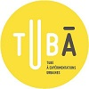

|||||||
|---|---|---|---|---|---|

# VegetaLyon
Dates du projet

>*Nous sommes un groupe de cinq étudiants de l’École Centrale de Nantes en option ville numérique, qui avons travaillé en partenariat avec le projet DatAgora dans le cadre de notre option. Notre formation vise à nous former à l’utilisation de données avec une dimension urbaine. Nous avons, à ce sujet, eu des cours de bases de données, de systèmes d’informations géographiques, d’enjeux de la représentation et de la visualisation, ainsi que des cours de modélisation.
  Au cours de ce projet, nous avons travaillé avec Gilles Gesquière, notre commanditaire, et avons été encadrés par Myriam Servières et Vincent Tourre, professeurs à l’École Centrale de Nantes.*

Texte descriptif du projet. Contexte, méthodologie, objectifs, résultats, …
? Voir pour trame descriptif projet + cadrée?

### Composants 
**Créés dans le cadre du projet**
- Liste avec liens vers les pages composants
- Format : Nom du composant
 
**Utilisés dans le cadre du projet**
- Liste avec liens vers les pages composants
- Format : Nom du composant

### Partenaires impliqués
- Liste avec lien vers  la page projet du partenaire
- Format : Projet XXX chez ZZZ
### Références
- Liste avec lien 
- Format biblio 
### Pour aller plus loin 
- Liste avec lien 
- Format : descriptif de la ressource
- exemple : Autre utilisations des légos dans l'architecture 

